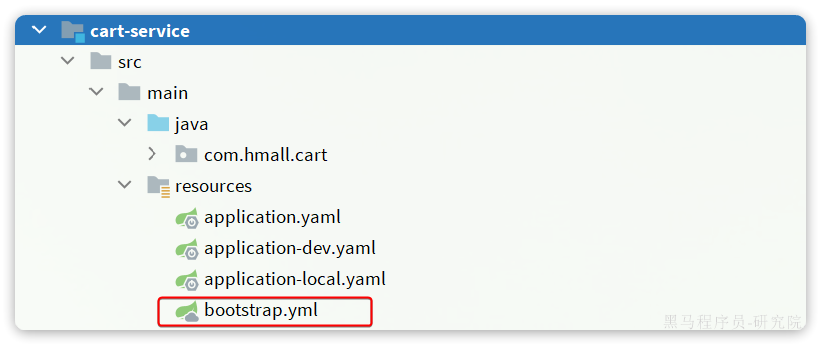

# Docker

Docker的常用命令参考：

[docker常规操作——启动、停止、重启容器实例_docker容器重启-CSDN博客](https://blog.csdn.net/Michel4Liu/article/details/80889977)

[docker查看容器/删除(所有)容器/删除镜像_查看docker删除运行的容实例-CSDN博客](https://blog.csdn.net/HYZX_9987/article/details/118999188)

[设置docker开机自启动，并设置容器自动重启_小雅全家桶容器重启-CSDN博客](https://blog.csdn.net/chj_1224365967/article/details/109029856)


# Spring Cloud


## 服务拆分

> - **高内聚**：每个微服务的职责要尽量单一，包含的业务相互关联度高、完整度高。
> - **低耦合**：每个微服务的功能要相对独立，尽量减少对其它微服务的依赖，或者依赖接口的稳定性要强。

> **高内聚**首先是**单一职责，**但不能说一个微服务就一个接口，而是要保证微服务内部业务的完整性为前提。目标是当我们要修改某个业务时，最好就只修改当前微服务，这样变更的成本更低。
>
> 一旦微服务做到了高内聚，那么服务之间的**耦合度**自然就降低了。
>
> 当然，微服务之间不可避免的会有或多或少的业务交互，比如下单时需要查询商品数据。这个时候我们不能在订单服务直接查询商品数据库，否则就导致了数据耦合。而应该由商品服务对应暴露接口，并且一定要保证微服务对外**接口的稳定性**（即：尽量保证接口外观不变）。虽然出现了服务间调用，但此时无论你如何在商品服务做内部修改，都不会影响到订单微服务，服务间的耦合度就降低了。

拆分方式有如下两种：

- **纵向**拆分
- **横向**拆分

> 所谓**纵向拆分**，就是按照项目的功能模块来拆分。例如黑马商城中，就有用户管理功能、订单管理功能、购物车功能、商品管理功能、支付功能等。那么按照功能模块将他们拆分为一个个服务，就属于纵向拆分。这种拆分模式可以尽可能提高服务的内聚性。
>
> 而**横向拆分**，是看各个功能模块之间有没有公共的业务部分，如果有将其抽取出来作为通用服务。例如用户登录是需要发送消息通知，记录风控数据，下单时也要发送短信，记录风控数据。因此消息发送、风控数据记录就是通用的业务功能，因此可以将他们分别抽取为公共服务：消息中心服务、风控管理服务。这样可以提高业务的复用性，避免重复开发。同时通用业务一般接口稳定性较强，也不会使服务之间过分耦合。


## 服务治理

拆分服务后，不同的模块的业务需求多数会与其他模块产生联系，此时需要远程调用其他模块的接口获取数据，较为原始的方法有RestTemplate，但其缺点在于代码死板，不能灵活变通，而且代码量大，所以引入注册中心的概念：通过注册中心将不同的模块引入，便于统一管理和调用。


### 注册中心

> 在微服务远程调用的过程中，包括两个角色：
>
> - 服务提供者：提供接口供其它微服务访问，比如`item-service`
> - 服务消费者：调用其它微服务提供的接口，比如`cart-service`


#### Nacos注册中心

阿里巴巴开发，目前被集成在SpringCloudAlibaba中，一般用于Java应用，同时还存在Eureka（Netflix公司出品），Consul（HashiCorp公司出品），均被集成再Spring Cloud中。


Nacos的使用十分简单，步骤如下：

- 引入依赖
- 配置Nacos地址
- 重启

引入Nacos依赖：

```XML
<!--nacos 服务注册发现-->
<dependency>
    <groupId>com.alibaba.cloud</groupId>
    <artifactId>spring-cloud-starter-alibaba-nacos-discovery</artifactId>
</dependency>
```

配置Nacos：

```YAML
spring:
  application:
    name: item-service # 服务名称
  cloud:
    nacos:
      server-addr: 192.168.150.101:8848 # nacos地址
```


## OpenFeign

> OpenFeign利用SpringMVC的相关注解来声明请求方式、请求路径、请求参数、返回值类型，然后基于动态代理帮我们生成远程调用的代码，而无需我们手动再编写，非常方便。


### 使用

#### 导入依赖

在`cart-service`服务的pom.xml中引入`OpenFeign`的依赖和`loadBalancer`依赖：

```XML
  <!--openFeign-->
  <dependency>
      <groupId>org.springframework.cloud</groupId>
      <artifactId>spring-cloud-starter-openfeign</artifactId>
  </dependency>
  <!--负载均衡器-->
  <dependency>
      <groupId>org.springframework.cloud</groupId>
      <artifactId>spring-cloud-starter-loadbalancer</artifactId>
  </dependency>
```


#### 启用OpenFeign

在启动类上添加注解`@EnableFeignClients`，启动OpenFeign功能：


#### 编写OpenFeign客户端

创建接口类，实现方式如Controller接口一致，无需实现。需要注意的是要使用`@FeignClient("服务名称")`为接口类声明服务名称。


### 连接池

Feign底层发起http请求，依赖于其它的框架。其底层支持的http客户端实现包括：

- HttpURLConnection：默认实现，不支持连接池
- Apache HttpClient ：支持连接池
- OKHttp：支持连接池

因此我们通常会使用带有连接池的客户端来代替默认的HttpURLConnection。比如，我们使用OK Http.

连接池可以优化OpenFeign的性能。


#### 引入依赖

```XML
<!--OK http 的依赖 -->
<dependency>
  <groupId>io.github.openfeign</groupId>
  <artifactId>feign-okhttp</artifactId>
</dependency>
```


#### 开启连接池

在`application.yml`配置文件中开启Feign的连接池功能：

```YAML
feign:
  okhttp:
    enabled: true # 开启OKHttp功能
```


### 最佳实践

对于某些客户端而言，其会被多个模块使用，这就造成了重复编码，应对的思路就是将重复的代码抽取出来，一般有两种方式：

- 思路1：抽取到微服务之外的公共module
- 思路2：每个微服务自己抽取一个module


两个方案之间的差别在于：

方案1抽取更加简单，工程结构也比较清晰，但缺点是整个项目耦合度偏高。

方案2抽取相对麻烦，工程结构相对更复杂，但服务之间耦合度降低。


个人看法：方案一便于维护


#### 抽取Feign客户端

1. 新建一个模块
2. 导入依赖
3. 建立domain类和client类
4. 在client类中编写接口

需要注意的是：当其他模块需要调用接口时，请求参数和返回参数的接值都需要使用该模块中的domain类中的类


#### 扫描包配置

调用API的模块扫描不到客户端，此时需要进行配置

- 声明扫描包：

​	在启动类上启用注解`@EnableFeignClients(basePackages = "Feign客户端所在包")`

- 声明要用的FeignClient

​	单独声明，`@EnablefeignClients(clients = {client1, client2,...})`


### 日志配置

> OpenFeign只会在FeignClient所在包的日志级别为**DEBUG**时，才会输出日志。而且其日志级别有4级：
>
> - **NONE**：不记录任何日志信息，这是默认值。
> - **BASIC**：仅记录请求的方法，URL以及响应状态码和执行时间
> - **HEADERS**：在BASIC的基础上，额外记录了请求和响应的头信息
> - **FULL**：记录所有请求和响应的明细，包括头信息、请求体、元数据。
>
> Feign默认的日志级别就是NONE，所以默认我们看不到请求日志。


##### 定义日志级别

定义一个config类，新建配置类，定义Feign的日志级别

```java
package com.qingmuy.api.config;

import feign.Logger;
import org.springframework.context.annotation.Bean;

public class DefaultFeignConfig {
    @Bean
    public Logger.Level feignLoggerLevel() {
        return Logger.Level.FULL;
    }
}
```


##### 配置

要让日志级别生效，还需要配置这个类。有两种方法：

- **局部**生效：在某个`FeignClient`中配置，只对当前`FeignClient`生效

```Java
@FeignClient(value = "item-service", configuration = DefaultFeignConfig.class)
```

- **全局**生效：在`@EnableFeignClients`中配置，针对所有`FeignClient`生效。

```Java
@EnableFeignClients(defaultConfiguration = DefaultFeignConfig.class)
```


## 网关路由

前端在于后端交互时，前端中的后端URI地址往往是写死的，这与微服务的多实例特性冲突，所以需要一个统一的地址来转发不同微服务之间的数据。


### 使用

大概步骤如下：

- 创建网关微服务
- 引入SpringCloudGateway、NacosDiscovery依赖
- 编写启动类
- 配置网关路由


#### 创建项目

创建一个新的模块，作为网关微服务


#### 引入依赖

在该模块下引入依赖：

```XML
<dependencies>
    <!--common-->
    <dependency>
        <groupId>com.heima</groupId>
        <artifactId>hm-common</artifactId>
        <version>1.0.0</version>
    </dependency>
    <!--网关-->
    <dependency>
        <groupId>org.springframework.cloud</groupId>
        <artifactId>spring-cloud-starter-gateway</artifactId>
    </dependency>
    <!--nacos discovery-->
    <dependency>
        <groupId>com.alibaba.cloud</groupId>
        <artifactId>spring-cloud-starter-alibaba-nacos-discovery</artifactId>
    </dependency>
    <!--负载均衡-->
    <dependency>
        <groupId>org.springframework.cloud</groupId>
        <artifactId>spring-cloud-starter-loadbalancer</artifactId>
    </dependency>
</dependencies>
```


#### 启动类

新建启动类


#### 配置路由

在`resources`目录下新建`application.yaml`文件，声明路由：

```YAML
server:
  port: 8080
spring:
  application:
    name: gateway
  cloud:
    nacos:
      server-addr: 192.168.150.101:8848
    gateway:
      routes:
        - id: item # 路由规则id，自定义，唯一
          uri: lb://item-service # 路由的目标服务，lb代表负载均衡，会从注册中心拉取服务列表
          predicates: # 路由断言，判断当前请求是否符合当前规则，符合则路由到目标服务
            - Path=/items/**,/search/** # 这里是以请求路径作为判断规则
        - id: cart
          uri: lb://cart-service
          predicates:
            - Path=/carts/**
        - id: user
          uri: lb://user-service
          predicates:
            - Path=/users/**,/addresses/**
        - id: trade
          uri: lb://trade-service
          predicates:
            - Path=/orders/**
        - id: pay
          uri: lb://pay-service
          predicates:
            - Path=/pay-orders/**
```


### 路由过滤

路由规则的定义语法如下：

```YAML
spring:
  cloud:
    gateway:
      routes:
        - id: item
          uri: lb://item-service
          predicates:
            - Path=/items/**,/search/**
```

`routes`是一个集合，即可以定义很多的路由规则，常见的属性如下：

- `id`：路由的唯一标示
- `predicates`：路由断言，其实就是匹配条件
- `filters`：路由过滤条件，后面讲
- `uri`：路由目标地址，`lb://`代表负载均衡，从注册中心获取目标微服务的实例列表，并且负载均衡选择一个访问。

对于`predicates`路由断言，SpringCloudGateway中支持的断言类型有很多：

| **名称**   | **说明**                       | **示例**                                                     |
| :--------- | :----------------------------- | :----------------------------------------------------------- |
| After      | 是某个时间点后的请求           | - After=2037-01-20T17:42:47.789-07:00[America/Denver]        |
| Before     | 是某个时间点之前的请求         | - Before=2031-04-13T15:14:47.433+08:00[Asia/Shanghai]        |
| Between    | 是某两个时间点之前的请求       | - Between=2037-01-20T17:42:47.789-07:00[America/Denver], 2037-01-21T17:42:47.789-07:00[America/Denver] |
| Cookie     | 请求必须包含某些cookie         | - Cookie=chocolate, ch.p                                     |
| Header     | 请求必须包含某些header         | - Header=X-Request-Id, \d+                                   |
| Host       | 请求必须是访问某个host（域名） | - Host=**.somehost.org,**.anotherhost.org                    |
| Method     | 请求方式必须是指定方式         | - Method=GET,POST                                            |
| Path       | 请求路径必须符合指定规则       | - Path=/red/{segment},/blue/**                               |
| Query      | 请求参数必须包含指定参数       | - Query=name, Jack或者- Query=name                           |
| RemoteAddr | 请求者的ip必须是指定范围       | - RemoteAddr=192.168.1.1/24                                  |
| weight     | 权重处理                       |                                                              |


### 网关登录校验

> 单体架构时我们只需要完成一次用户登录、身份校验，就可以在所有业务中获取到用户信息。而微服务拆分后，每个微服务都独立部署，不再共享数据。也就意味着每个微服务都需要做登录校验，这显然不可取。


如果每个微服务都做登录校验会存在两个问题：

- 每个微服务都需要知道JWT的秘钥，不安全
- 每个微服务重复编写登录校验代码、权限校验代码，麻烦


网关作为微服务的入口，一切请求皆需要首先经过网关，所以可以将登录校验交给网关做。此时校验流程如下：


此时仍存在一些问题：

- 网关路由是配置的，请求转发是Gateway内部代码，如何在转发之前做登录校验？
- 网关校验JWT之后，如何将用户信息传递给微服务？
- 微服务之间也会相互调用，这种调用不经过网关，又该如何传递用户信息？


#### 网关过滤器

> 登录校验必须在请求转发到微服务之前做，否则就失去了意义。而网关的请求转发是`Gateway`内部代码实现的，要想在请求转发之前做登录校验，就必须了解`Gateway`内部工作的基本原理。


如图所示，大致流程如下：

1. 客户端请求进入网关后由`HandlerMapping`对请求做判断，找到与当前请求匹配的路由规则（**`Route`**），然后将请求交给`WebHandler`去处理。
2. `WebHandler`则会加载当前路由下需要执行的过滤器链（**`Filter chain`**），然后按照顺序逐一执行过滤器（后面称为**`Filter`**）。
3. 图中`Filter`被虚线分为左右两部分，是因为`Filter`内部的逻辑分为`pre`和`post`两部分，分别会在请求路由到微服务**之前**和**之后**被执行。
4. 只有所有`Filter`的`pre`逻辑都依次顺序执行通过后，请求才会被路由到微服务。
5. 微服务返回结果后，再倒序执行`Filter`的`post`逻辑。
6. 最终把响应结果返回。


最终请求转发是有一个名为`NettyRoutingFilter`的过滤器来执行的，而且这个过滤器是整个过滤器链中顺序最靠后的一个。**需要定义一个过滤器，在其中实现登录校验逻辑，并且将过滤器执行顺序定义到**`NettyRoutingFilter`**之前**，即可符合需求。

问题在于如何实现一个网关过滤器？

网关过滤器链中的过滤器有两种：

- **`GatewayFilter`**：路由过滤器，作用范围比较灵活，可以是任意指定的路由`Route`. 
- **`GlobalFilter`**：全局过滤器，作用范围是所有路由，不可配置。

**注意**：过滤器链之外还有一种过滤器，HttpHeadersFilter，用来处理传递到下游微服务的请求头。例如org.springframework.cloud.gateway.filter.headers.XForwardedHeadersFilter可以传递代理请求原本的host头到下游微服务。


实际上`GatewayFilter`和`GlobalFilter`这两种过滤器的方法签名完全一致：

```Java
/**
 * 处理请求并将其传递给下一个过滤器
 * @param exchange 当前请求的上下文，其中包含request、response等各种数据
 * @param chain 过滤器链，基于它向下传递请求
 * @return 根据返回值标记当前请求是否被完成或拦截，chain.filter(exchange)就放行了。
 */
Mono<Void> filter(ServerWebExchange exchange, GatewayFilterChain chain);
```

`FilteringWebHandler`在处理请求时，会将`GlobalFilter`装饰为`GatewayFilter`，然后放到同一个过滤器链中，排序以后依次执行。


**注意**：`exchange`和`chain`两个参数

- `exchange`内部存放了当前请求的上下文，其中包含request、response等各种数据
- `chain`过滤器链，基于它向下传递请求


`Gateway`内置的`GatewayFilter`过滤器使用起来非常简单，无需编码，只要在yaml文件中简单配置即可。而且其作用范围也很灵活，配置在哪个`Route`下，就作用于哪个`Route`.


例如，有一个过滤器叫做`AddRequestHeaderGatewayFilterFacotry`，顾明思议，就是添加请求头的过滤器，可以给请求添加一个请求头并传递到下游微服务。

使用的使用只需要在application.yaml中这样配置：

```YAML
spring:
  cloud:
    gateway:
      routes:
      - id: test_route
        uri: lb://test-service
        predicates:
          -Path=/test/**
        filters:
          - AddRequestHeader=key, value # 逗号之前是请求头的key，逗号之后是value
```

如果想要让过滤器作用于所有的路由，则可以这样配置：

```YAML
spring:
  cloud:
    gateway:
      default-filters: # default-filters下的过滤器可以作用于所有路由
        - AddRequestHeader=key, value
      routes:
      - id: test_route
        uri: lb://test-service
        predicates:
          -Path=/test/**
```


#### 自定义过滤器

无论是`GatewayFilter`还是`GlobalFilter`都支持自定义，只不过**编码**方式、**使用**方式略有差别。


##### 自定义GatewayFilter

自定义`GatewayFilter`不是直接实现`GatewayFilter`，而是实现`AbstractGatewayFilterFactory`。最简单的方式是这样的：

```Java
@Component
public class PrintAnyGatewayFilterFactory extends AbstractGatewayFilterFactory<Object> {
    @Override
    public GatewayFilter apply(Object config) {
        return new GatewayFilter() {
            @Override
            public Mono<Void> filter(ServerWebExchange exchange, GatewayFilterChain chain) {
                // 获取请求
                ServerHttpRequest request = exchange.getRequest();
                // 编写过滤器逻辑
                System.out.println("过滤器执行了");
                // 放行
                return chain.filter(exchange);
            }
        };
    }
}
```

**注意**：该类的名称一定要以`GatewayFilterFactory`为后缀！

然后在yaml配置中这样使用：

```YAML
spring:
  cloud:
    gateway:
      default-filters:
            - PrintAny # 此处直接以自定义的GatewayFilterFactory类名称前缀类声明过滤器
```

这种过滤器还可以支持动态配置参数，不过实现起来比较复杂。


##### 自定义GlobalFilter

自定义GlobalFilter则简单很多，直接实现GlobalFilter即可，而且也无法设置动态参数：

```Java
@Component
public class PrintAnyGlobalFilter implements GlobalFilter, Ordered {
    @Override
    public Mono<Void> filter(ServerWebExchange exchange, GatewayFilterChain chain) {
        // 编写过滤器逻辑
        System.out.println("未登录，无法访问");
        // 放行
        // return chain.filter(exchange);

        // 拦截
        ServerHttpResponse response = exchange.getResponse();
        response.setRawStatusCode(401);
        return response.setComplete();
    }

    @Override
    public int getOrder() {
        // 过滤器执行顺序，值越小，优先级越高
        return 0;
    }
}
```


#### 登录校验

利用自定义`GlobalFilter`来完成登录校验。


##### JWT工具

- `AuthProperties`：配置登录校验需要拦截的路径，因为不是所有的路径都需要登录才能访问
- `JwtProperties`：定义与JWT工具有关的属性，比如秘钥文件位置
- `SecurityConfig`：工具的自动装配
- `JwtTool`：JWT工具，其中包含了校验和解析`token`的功能
- `hmall.jks`：秘钥文件

其中`AuthProperties`和`JwtProperties`所需的属性要在`application.yaml`中配置，即读取yaml文件中的配置。


##### 登录校验过滤器

1. 根据`exchange`获取`request`请求头
2. 从请求头中获取访问路径，判断是否需要拦截，无需拦截直接放行即可
3. 从`request`请求头中获取`token`

```java
String token = null;
List<String> headers = request.getHeaders().get("authorization");
if (headers != null && !headers.isEmpty()) {
    token = headers.get(0);
}
```

4. 解析校验`token`，解析失败则拦截该请求并直接返回`401`未登录状态码		

```java
// 解析失败，拦截并返回设置状态码为401
ServerHttpResponse response = exchange.getResponse();
response.setStatusCode(HttpStatus.UNAUTHORIZED);
return response.setComplete();
```

5. 传递用户信息

```java
String userInfo = userId.toString();
ServerWebExchange swe = exchange.mutate()
        .request(builder -> builder.header("user-info", userInfo))
        .build();
```

5. 放行


#### 微服务获取用户

网关获取用户数据之后，需要将用户数据转发给各个微服务，所以需要：

- 改造网关过滤器，在获取用户信息后保存到请求头，转发到下游微服务
- 编写微服务拦截器，拦截请求获取用户信息，保存到ThreadLocal后放行


##### 保存用户到请求头

在登录校验拦截器处修改逻辑将用户信息保存到请求头中：

```java
String userInfo = userId.toString();
ServerWebExchange swe = exchange.mutate()
        .request(builder -> builder.header("user-info", userInfo))
        .build();
```


##### 拦截器获取用户

由于每个微服务都有获取登录用户的需求，因此拦截器我们直接写在`hm-common`中，并写好自动装配。这样微服务只需要引入`hm-common`就可以直接具备拦截器功能，无需重复编写。

定义拦截器并编写逻辑：

```java
public class UserInfoInterceptor implements HandlerInterceptor {

    @Override
    public boolean preHandle(HttpServletRequest request, HttpServletResponse response, Object handler) throws Exception {
        // 1. 获取登录用户信息
        String userInfo = request.getHeader("user-info");
        // 2. 判断是否获取了用户，如果有则存入ThreadLocal
        if (StrUtil.isNotBlank(userInfo)) {
            UserContext.setUser(Long.valueOf(userInfo));
        }
        // 3. 放行
        return true;
    }

    @Override
    public void afterCompletion(HttpServletRequest request, HttpServletResponse response, Object handler, Exception ex) throws Exception {
        UserContext.removeUser();
    }
}
```

再编写配置类，将拦截器注册到配置中：

```java
@Configuration
@ConditionalOnClass(DispatcherServlet.class)
public class MvcConfig implements WebMvcConfigurer {
    @Override
    public void addInterceptors(InterceptorRegistry registry) {
        // 默认拦截所有路径
        registry.addInterceptor(new UserInfoInterceptor());
    }
}
```


需要注意的是，这个配置类默认是不会生效的，因为它所在的包是`com.hmall.common.config`，与其它微服务的扫描包不一致，无法被扫描到，因此无法生效。

基于SpringBoot的自动装配原理，我们要将其添加到`resources`目录下的`META-INF/spring.factories`文件中

```properties
org.springframework.boot.autoconfigure.EnableAutoConfiguration=\
  com.hmall.common.config.MyBatisConfig,\
  com.hmall.common.config.MvcConfig,\
  com.hmall.common.config.JsonConfig
```


#### openFeign传递用户

尽管上述的方法将用户信息存储在了线程中，但是对于一些复杂的业务：需要调用其他模块的业务而言，由于不同的实例间线程不一致，无法继续保存用户信息，所以需要**在微服务发起调用时把用户信息存入请求头**。


微服务之间调用是基于OpenFeign来实现的，并不是我们自己发送的请求。我们如何才能让每一个由OpenFeign发起的请求自动携带登录用户信息呢？

这里要借助Feign中提供的一个拦截器接口：`feign.RequestInterceptor`

```Java
public interface RequestInterceptor {

  /**
   * Called for every request. 
   * Add data using methods on the supplied {@link RequestTemplate}.
   */
  void apply(RequestTemplate template);
}
```


我们只需要实现这个接口，然后实现apply方法，利用`RequestTemplate`类来添加请求头，将用户信息保存到请求头中。这样以来，每次OpenFeign发起请求的时候都会调用该方法，传递用户信息。

将该拦截器的配置写入`FeignClient`的api模块中：

在`com.qingmuy.api.config.DefaultFeignConfig`中添加一个Bean：

```Java
@Bean
public RequestInterceptor userInfoRequestInterceptor(){
    return new RequestInterceptor() {
        @Override
        public void apply(RequestTemplate template) {
            // 获取登录用户
            Long userId = UserContext.getUser();
            if(userId == null) {
                // 如果为空则直接跳过
                return;
            }
            // 如果不为空则放入请求头中，传递给下游微服务
            template.header("user-info", userId.toString());
        }
    };
}
```


### 配置管理

微服务的多模块特性导致配置文件数量多，不易维护，可以通过Nacos的配置管理器服务统一管理。


微服务共享的配置可以统一交给Nacos保存和管理，在Nacos控制台修改配置后，Nacos会将配置变更推送给相关的微服务，并且无需重启即可生效，实现配置热更新。

网关的路由同样是配置，因此同样可以基于这个功能实现动态路由功能，无需重启网关即可修改路由配置。


#### 配置共享

我们可以把微服务共享的配置抽取到Nacos中统一管理，这样就不需要每个微服务都重复配置了。分为两步：

- 在Nacos中添加共享配置
- 微服务拉取配置


##### 添加共享配置

将配置文件中重复的部分抽取出来，在Nacos中的`配置管理`->`配置列表`中点击`+`新建一个配置，键入信息即可。

在可设定的参数的后方使用`:`连接默认设置，如

```yaml
username: ${muy.database.username:dingzhen}
```


##### 拉取共享配置

需要注意的是，读取Nacos配置是SpringCloud上下文（`ApplicationContext`）初始化时处理的，发生在项目的引导阶段。然后才会初始化SpringBoot上下文，去读取`application.yaml`。

也就是说引导阶段，`application.yaml`文件尚未读取，根本不知道nacos 地址，该如何去加载nacos中的配置文件呢？

SpringCloud在初始化上下文的时候会先读取一个名为`bootstrap.yaml`(或者`bootstrap.properties`)的文件，如果我们将nacos地址配置到`bootstrap.yaml`中，那么在项目引导阶段就可以读取nacos中的配置了。


因此，微服务整合Nacos配置管理的步骤如下：

1. 引入依赖：

在cart-service模块引入依赖：

```XML
  <!--nacos配置管理-->
  <dependency>
      <groupId>com.alibaba.cloud</groupId>
      <artifactId>spring-cloud-starter-alibaba-nacos-config</artifactId>
  </dependency>
  <!--读取bootstrap文件-->
  <dependency>
      <groupId>org.springframework.cloud</groupId>
      <artifactId>spring-cloud-starter-bootstrap</artifactId>
  </dependency>
```

2. 新建bootstrap.yaml

在cart-service中的resources目录新建一个bootstrap.yaml文件：



内容如下：

```YAML
spring:
  application:
    name: cart-service # 服务名称
  profiles:
    active: dev
  cloud:
    nacos:
      server-addr: 192.168.150.101 # nacos地址
      config:
        file-extension: yaml # 文件后缀名
        shared-configs: # 共享配置
          - dataId: shared-jdbc.yaml # 共享mybatis配置
          - dataId: shared-log.yaml # 共享日志配置
          - dataId: shared-swagger.yaml # 共享日志配置
```

3. 修改application.yaml

由于一些配置挪到了bootstrap.yaml，因此application.yaml需要修改为：

```YAML
server:
  port: 8082
feign:
  okhttp:
    enabled: true # 开启OKHttp连接池支持
hm:
  swagger:
    title: 购物车服务接口文档
    package: com.hmall.cart.controller
  db:
    database: hm-cart
```

重启服务，发现所有配置都生效了。


#### 配置热更新

当修改配置文件中的配置时，微服务无需重启即可使配置生效。

前提条件：

1. nacos中要有一个与微服务名有关的配置文件，命名格式为

[spring.application.name]-[spring.active.profile].[file-extension]

其中第一个字段微服务名称；第二个字段为项目profile，为可选参数；第三个字段为文件后缀名。

微服务在启动时会自动寻找相同名称的配置文件读取。

2. 微服务要以特定的方式读取需要热更新的配置属性

有两种配置方式：

一为直接读取配置文件：

```java
@Data
@ConfigurationProperties(prefix = "hm.cart")
public class CartProperties {
    private int maxItems;
}
```

另一种为使用注解标准热更新

```java
@Data
@RefreshScope
public class CartProperties {
    @Value("${hm.cart.maxItems}")
    private int maxItems;
}
```


#### 动态路由

要实现动态路由首先要将路由配置保存到Nacos，当Nacos中的路由配置变更时，推送最新配置到网关，实时更新网关中的路由信息。

我们需要完成两件事情:

1. 监听Nacos配置变更的消息
2. 当配置变更时，将最新的路由信息更新到网关路由表 


基于Nacos的源码[Java SDK (nacos.io)](https://nacos.io/zh-cn/docs/sdk.html)得知：Nacos会在项目启动时自动拉取配置并写入路由，而且可以自定义添加监听器。

所以可以在网关`Gateway`中新建一个`routers`包用于定义配置监听器：


配置动态路由需要两个必要的Bean组件，分别为：`NacosConfigManager`和`RouteDefinitionWriter`

其中`NacosConfigManager`用于控制Nacos配置监听器以及拉取配置更新；`RouteDefinitionWriter`用于将路由写入路由表或删除路由表。


首先控制路由的热更新，需要完成路由的更新操作，这就需要先完成路由表的初始化操作：初始化监听器

```java
@PostConstruct  // 在bean初始化时执行
    public void initRouteConfigListener() throws NacosException {
        // 项目启动时，先拉取一次配置，并且添加配置监听器
        String configInfo = nacosConfigManager.getConfigService()
                // 拉取配置并建立监听器
                .getConfigAndSignListener(dataId, group, 5000, new Listener() {

                    @Override
                    public Executor getExecutor() {
                        // 返回一个线程池：监听器的执行会异步执行
                        return null;
                    }

                    @Override
                    public void receiveConfigInfo(String configInfo) {
                        // 监听到配置变更， 需要去更新路由表
                        updateConfigInfo(configInfo);
                    }
                });
        // 第一次读取到配置，也需要更新到路由表
        updateConfigInfo(configInfo);
    }
```

`@PostConstruct`注解会在该组件类加载时先执行当前方法，这也就确保了初始化的完成。

通过`getConfigAndSignListener`方法可以实现拉取配置并建立监听器的操作，监听器`Listener`是一个接口，需要完成两个方法：`getExecutor`和`receiveConfigInfo`，其中`getExecutor`是返回一个线程池：便于在复杂业务时控制监听器；而`receiveConfigInfo`则会监听配置的更新并拉取配置信息。

拉取配置并建立监听器后需要更新到路由表，此时再利用`RouteDefinitionWriter`完成对路由表的操作。

```java
public void updateConfigInfo(String configInfo){
    log.info("监听到路由配置信息：{}", configInfo);
    // 1. 解析配置信息，转为RouteDefinition
    List<RouteDefinition> routeDefinitions = JSONUtil.toList(configInfo, RouteDefinition.class);
    // 2. 删除旧的路由表
    for (String routeId : routeIds) {
        writer.delete(Mono.just(routeId)).subscribe();
    }
    routeIds.clear();
    // 3. 更新路由表
    for (RouteDefinition routeDefinition : routeDefinitions) {
        // 更新路由表，将路由表转化为Mono类型
        writer.save(Mono.just(routeDefinition)).subscribe();    // subscribe会立即使更新生效：订阅
        // 记录路由id，便于下一次更新时删除
        routeIds.add(routeDefinition.getId());
    }
}
```

读取配置文件时，需要将配置文件解析，但是由于`yaml`配置文件不方便解析，所以将会使用`json`格式存储路由配置，故读取的配置文件为`json`类型，再将`json`文件读取并转换为列表类型即可。

对于路由表的更新操作，如果为增添路由，则将新的路由表写入即可，所以使用循环的方式全部写入，需要注意的是在写入时需要将`RouteDefinition`路由格式转为`Mono`格式，再调用`subscribe()`方法使更新立即生效。

而如果是删除路由操作，则需要删除全部的路由表再全部添加即可，而删除路由表需要逐个删除且使用的是路由的id，而当前并无方法获取路由表中路由的id，而在初始化的过程中会在第一次读取配置时调用更新路由方法，可以编写一个固定的`Set`集合用于存储路由的id，故当初始化时会记录各个路由id，后续更新操作均会保存路由id。


## 微服务保护和分布式事务


### 雪崩问题

微服务调用链路中的某个服务故障，引起整个链路中的所有微服务都不可用，这就是雪崩。


雪崩问题产生的原因是什么?

- 微服务相互调用，服务提供者出现故障或阻塞。
- 服务调用者没有做好异常处理，导致自身故障。
- 调用链中的所有服务级联失败，导致整个集群故障


解决问题的思路有哪些?

- 尽量避免服务出现故障或阻塞。
  - 保证代码的健壮性;
  - 保证网络畅通;
  - 能应对较高的并发请求;
- 服务调用者做好远程调用异常的后备方案，避免故障扩散


#### 解决方案

1. 请求限流：限制访问微服务的请求的并发量，避免服务因流量激增出现故障。

2. 线程隔离︰也叫做舱壁模式，模拟船舱隔板的防水原理。通过限定每个业务能使用的线程数量而将故障业务隔离，避免故障扩散。
3. 服务熔断:由断路器统计请求的异常比例或慢调用比例，如果超出阈值则会熔断该业务，则拦截该接口的请求。熔断期间，所有请求快速失败，全都走fallback逻辑。
4. 失败处理:定义fallback逻辑，让业务失败时不冉把出异吊，定及回默认数据或友好提示


##### 请求限流

服务故障最重要原因，就是并发太高！解决了这个问题，就能避免大部分故障。当然，接口的并发不是一直很高，而是突发的。因此请求限流，就是**限制或控制**接口访问的并发流量，避免服务因流量激增而出现故障。

请求限流往往会有一个限流器，数量高低起伏的并发请求曲线，经过限流器就变的非常平稳。这就像是水电站的大坝，起到蓄水的作用，可以通过开关控制水流出的大小，让下游水流始终维持在一个平稳的量。


##### 线程隔离

当一个业务接口响应时间长，而且并发高时，就可能耗尽服务器的线程资源，导致服务内的其它接口受到影响。所以我们必须把这种影响降低，或者缩减影响的范围。线程隔离正是解决这个问题的好办法。

线程隔离的思想来自轮船的舱壁模式：


轮船的船舱会被隔板分割为N个相互隔离的密闭舱，假如轮船触礁进水，只有损坏的部分密闭舱会进水，而其他舱由于相互隔离，并不会进水。这样就把进水控制在部分船体，避免了整个船舱进水而沉没。

为了避免某个接口故障或压力过大导致整个服务不可用，我们可以限定每个接口可以使用的资源范围，也就是将其“隔离”起来。


如图所示，我们给查询购物车业务限定可用线程数量上限为20，这样即便查询购物车的请求因为查询商品服务而出现故障，也不会导致服务器的线程资源被耗尽，不会影响到其它接口。

##### 服务熔断

线程隔离虽然避免了雪崩问题，但故障服务（商品服务）依然会拖慢购物车服务（服务调用方）的接口响应速度。而且商品查询的故障依然会导致查询购物车功能出现故障，购物车业务也变的不可用了。

所以，我们要做两件事情：

- **编写服务降级逻辑**：就是服务调用失败后的处理逻辑，根据业务场景，可以抛出异常，也可以返回友好提示或默认数据。
- **异常统计和熔断**：统计服务提供方的异常比例，当比例过高表明该接口会影响到其它服务，应该拒绝调用该接口，而是直接走降级逻辑。


## MQ


- 同步通讯：就如同打视频电话，双方的交互都是实时的。因此同一时刻你只能跟一个人打视频电话。
- 异步通讯：就如同发微信聊天，双方的交互不是实时的，你不需要立刻给对方回应。因此你可以多线操作，同时跟多人聊天。


### 基础

业务需要实时得到服务提供方的响应，则应该选择同步通讯（同步调用）。而如果追求更高的效率，并且不需要实时响应，则应该选择异步通讯（异步调用）。


#### 同步调用

对于一个业务流程而言，多个微服务之间的调用就是同步通讯，必须等待上一个服务结束后才可以执行，这就导致：

- 拓展性差
- 性能下降
- 级联失败

所以需要使用异步调用代替同步调用


#### 异步调用

异步调用方式其实就是基于消息通知的方式，一般包含三个角色：

- 消息发送者：投递消息的人，就是原来的调用方
- 消息Broker：管理、暂存、转发消息，你可以把它理解成微信服务器
- 消息接收者：接收和处理消息的人，就是原来的服务提供方


在异步调用中，发送者不再直接同步调用接收者的业务接口，而是发送一条消息投递给消息Broker。然后接收者根据自己的需求从消息Broker那里订阅消息。每当发送方发送消息后，接受者都能获取消息并处理。

这样，发送消息的人和接收消息的人就完全解耦了。


异步调用的优势包括：

- 耦合度更低
- 性能更好
- 业务拓展性强
- 故障隔离，避免级联失败

当然，异步通信也并非完美无缺，它存在下列缺点：

- 完全依赖于Broker的可靠性、安全性和性能
- 架构复杂，后期维护和调试麻烦


#### 相关技术

消息Broker，目前常见的实现方案就是消息队列（MessageQueue），简称为MQ.

目比较常见的MQ实现：

- ActiveMQ
- RabbitMQ
- RocketMQ
- Kafka

几种常见MQ的对比：

|            | RabbitMQ                | ActiveMQ                       | RocketMQ   | Kafka      |
| ---------- | ----------------------- | ------------------------------ | ---------- | ---------- |
| 公司/社区  | Rabbit                  | Apache                         | 阿里       | Apache     |
| 开发语言   | Erlang                  | Java                           | Java       | Scala&Java |
| 协议支持   | AMQP，XMPP，SMTP，STOMP | OpenWire,STOMP，REST,XMPP,AMQP | 自定义协议 | 自定义协议 |
| 可用性     | 高                      | 一般                           | 高         | 高         |
| 单机吞吐量 | 一般                    | 差                             | 高         | 非常高     |
| 消息延迟   | 微秒级                  | 毫秒级                         | 毫秒级     | 毫秒以内   |
| 消息可靠性 | 高                      | 一般                           | 高         | 一般       |

追求可用性：Kafka、 RocketMQ 、RabbitMQ

追求可靠性：RabbitMQ、RocketMQ

追求吞吐能力：RocketMQ、Kafka

追求消息低延迟：RabbitMQ、Kafka


### RabbitMQ

RabbitMQ是基于Erlang语言开发的开源消息通信中间件，官网地址：

https://www.rabbitmq.com/


#### 安装

基于Docker安装RabbitMQ

```shell
docker run \
 -e RABBITMQ_DEFAULT_USER=itheima \
 -e RABBITMQ_DEFAULT_PASS=123321 \
 -v mq-plugins:/plugins \
 --name mq \
 --hostname mq \
 -p 15672:15672 \
 -p 5672:5672 \
 --network hm-net\
 -d \
 rabbitmq:3.8-management
```


RabbitMQ对应的架构如图：


其中包含几个概念：

- **`publisher`**：生产者，也就是发送消息的一方
- **`consumer`**：消费者，也就是消费消息的一方
- **`queue`**：队列，存储消息。生产者投递的消息会暂存在消息队列中，等待消费者处理
- **`exchange`**：交换机，负责消息路由。生产者发送的消息由交换机决定投递到哪个队列。
- **`virtual host`**：虚拟主机，起到数据隔离的作用。每个虚拟主机相互独立，有各自的exchange、queue


#### 收发消息

##### 交换机

可以使用交换机给队列发送消息，需要注意的是**交换机没有存储消息的能力**。


##### 队列

队列需要与交换机绑定后才能收发消息。


##### 绑定关系

点击`Exchanges`选项卡，点击对应交换机，进入交换机详情页，然后点击`Bindings`菜单，在表单中填写要绑定的队列名称，点击`bind`绑定即可。


#### 数据隔离

##### 用户管理

- `Name`：也就是用户名
- `Tags`：`administrator`，说明`itheima`用户是超级管理员，拥有所有权限
- `Can access virtual host`： `/`，可以访问的`virtual host`，这里的`/`是默认的`virtual host`

对于小型企业而言，出于成本考虑，我们通常只会搭建一套MQ集群，公司内的多个不同项目同时使用。这个时候为了避免互相干扰， 我们会利用`virtual host`的隔离特性，将不同项目隔离。一般会做两件事情：

- 给每个项目创建独立的运维账号，将管理权限分离。
- 给每个项目创建不同的`virtual host`，将每个项目的数据隔离。


##### virtual host

基于`virtual host `实现了隔离效果。


### SpringAMOP

#### 导入依赖

```XML
<?xml version="1.0" encoding="UTF-8"?>
<project xmlns="http://maven.apache.org/POM/4.0.0"
         xmlns:xsi="http://www.w3.org/2001/XMLSchema-instance"
         xsi:schemaLocation="http://maven.apache.org/POM/4.0.0 http://maven.apache.org/xsd/maven-4.0.0.xsd">
    <modelVersion>4.0.0</modelVersion>

    <groupId>cn.itcast.demo</groupId>
    <artifactId>mq-demo</artifactId>
    <version>1.0-SNAPSHOT</version>
    <modules>
        <module>publisher</module>
        <module>consumer</module>
    </modules>
    <packaging>pom</packaging>

    <parent>
        <groupId>org.springframework.boot</groupId>
        <artifactId>spring-boot-starter-parent</artifactId>
        <version>2.7.12</version>
        <relativePath/>
    </parent>

    <properties>
        <maven.compiler.source>8</maven.compiler.source>
        <maven.compiler.target>8</maven.compiler.target>
    </properties>

    <dependencies>
        <dependency>
            <groupId>org.projectlombok</groupId>
            <artifactId>lombok</artifactId>
        </dependency>
        <!--AMQP依赖，包含RabbitMQ-->
        <dependency>
            <groupId>org.springframework.boot</groupId>
            <artifactId>spring-boot-starter-amqp</artifactId>
        </dependency>
        <!--单元测试-->
        <dependency>
            <groupId>org.springframework.boot</groupId>
            <artifactId>spring-boot-starter-test</artifactId>
        </dependency>
    </dependencies>
</project>
```


#### 基础使用


##### 消息发送

首先配置MQ地址，在`publisher`服务的`application.yml`中添加配置：

```YAML
spring:
  rabbitmq:
    host: 192.168.150.101 # 你的虚拟机IP
    port: 5672 # 端口
    virtual-host: /hmall # 虚拟主机
    username: hmall # 用户名
    password: 123 # 密码
```

然后在`publisher`服务中编写测试类`SpringAmqpTest`，并利用`RabbitTemplate`实现消息发送：

```Java
package com.itheima.publisher.amqp;

import org.junit.jupiter.api.Test;
import org.springframework.amqp.rabbit.core.RabbitTemplate;
import org.springframework.beans.factory.annotation.Autowired;
import org.springframework.boot.test.context.SpringBootTest;

@SpringBootTest
public class SpringAmqpTest {

    @Autowired
    private RabbitTemplate rabbitTemplate;

    @Test
    public void testSimpleQueue() {
        // 队列名称
        String queueName = "simple.queue";
        // 消息
        String message = "hello, spring amqp!";
        // 发送消息
        rabbitTemplate.convertAndSend(queueName, message);
    }
}
```


##### 消息接收

首先配置MQ地址，在`consumer`服务的`application.yml`中添加配置：

```YAML
spring:
  rabbitmq:
    host: 192.168.150.101 # 你的虚拟机IP
    port: 5672 # 端口
    virtual-host: /hmall # 虚拟主机
    username: hmall # 用户名
    password: 123 # 密码
```

然后在`consumer`服务的`com.itheima.consumer.listener`包中新建一个类`SpringRabbitListener`，代码如下：

```Java
package com.itheima.consumer.listener;

import org.springframework.amqp.rabbit.annotation.RabbitListener;
import org.springframework.stereotype.Component;

@Component
public class SpringRabbitListener {
        // 利用RabbitListener来声明要监听的队列信息
    // 将来一旦监听的队列中有了消息，就会推送给当前服务，调用当前方法，处理消息。
    // 可以看到方法体中接收的就是消息体的内容
    @RabbitListener(queues = "simple.queue")
    public void listenSimpleQueueMessage(String msg) throws InterruptedException {
        System.out.println("spring 消费者接收到消息：【" + msg + "】");
    }
}
```


#### WorkQueues模型

Work queues，任务模型。简单来说就是**让****多个消费者****绑定到一个队列，共同消费队列中的消息**。

暂时无法在飞书文档外展示此内容

当消息处理比较耗时的时候，可能生产消息的速度会远远大于消息的消费速度。长此以往，消息就会堆积越来越多，无法及时处理。

此时就可以使用work 模型，**多个消费者共同处理消息处理，消息处理的速度就能大大提高**了。


但是默认的配置有如下问题：

消息是平均分配给每个消费者，并没有考虑到消费者的处理能力。导致1个消费者空闲，另一个消费者忙的不可开交。没有充分利用每一个消费者的能力，最终消息处理的耗时很长。这样显然是有问题的。


在spring中有一个简单的配置，可以解决这个问题。修改consumer服务的application.yml文件，添加配置：

```YAML
spring:
  rabbitmq:
    listener:
      simple:
        prefetch: 1 # 每次只能获取一条消息，处理完成才能获取下一个消息
```


Work模型的使用：

- 多个消费者绑定到一个队列，同一条消息只会被一个消费者处理
- 通过设置prefetch来控制消费者预取的消息数量


#### 交换机类型

引入交换机，消息发送的模式会有很大变化：


可以看到，在订阅模型中，多了一个exchange角色，而且过程略有变化：

- **Publisher**：生产者，不再发送消息到队列中，而是发给交换机
- **Exchange**：交换机，一方面，接收生产者发送的消息。另一方面，知道如何处理消息，例如递交给某个特别队列、递交给所有队列、或是将消息丢弃。到底如何操作，取决于Exchange的类型。
- **Queue**：消息队列也与以前一样，接收消息、缓存消息。不过队列一定要与交换机绑定。
- **Consumer**：消费者，与以前一样，订阅队列，没有变化

**Exchange（****交换机****）只负责转发消息，不具备存储消息的能力**，因此如果没有任何队列与Exchange绑定，或者没有符合路由规则的队列，那么消息会丢失！

交换机的类型有四种：

- **Fanout**：广播，将消息交给所有绑定到交换机的队列。我们最早在控制台使用的正是Fanout交换机
- **Direct**：订阅，基于RoutingKey（路由key）发送给订阅了消息的队列
- **Topic**：通配符订阅，与Direct类似，只不过RoutingKey可以使用通配符
- **Headers**：头匹配，基于MQ的消息头匹配，用的较少。


#### Fanout交换机

Fanout可以理解为广播。


在广播模式下，消息发送流程是这样的：


- 1）  可以有多个队列
- 2）  每个队列都要绑定到Exchange（交换机）
- 3）  生产者发送的消息，只能发送到交换机
- 4）  交换机把消息发送给绑定过的所有队列
- 5）  订阅队列的消费者都能拿到消息


交换机的作用如下：

- 接收publisher发送的消息
- 将消息按照规则路由到与之绑定的队列
- 不能缓存消息，路由失败，消息丢失
- FanoutExchange的会将消息路由到每个绑定的队列


#### Direct交换机

在Fanout模式中，一条消息，会被所有订阅的队列都消费。但是，在某些场景下，我们希望不同的消息被不同的队列消费。这时就要用到Direct类型的Exchange。


在Direct模型下：

- 队列与交换机的绑定，不能是任意绑定了，而是要指定一个`RoutingKey`（路由key）
- 消息的发送方在 向 Exchange发送消息时，也必须指定消息的 `RoutingKey`。
- Exchange不再把消息交给每一个绑定的队列，而是根据消息的`Routing Key`进行判断，只有队列的`Routingkey`与消息的 `Routing key`完全一致，才会接收到消息


描述下Direct交换机与Fanout交换机的差异：

- Fanout交换机将消息路由给每一个与之绑定的队列
- Direct交换机根据RoutingKey判断路由给哪个队列
- 如果多个队列具有相同的RoutingKey，则与Fanout功能类似


#### Topic交换机

`Topic`类型的`Exchange`与`Direct`相比，都是可以根据`RoutingKey`把消息路由到不同的队列。

只不过`Topic`类型`Exchange`可以让队列在绑定`BindingKey` 的时候使用通配符！

```
BindingKey` 一般都是有一个或多个单词组成，多个单词之间以`.`分割，例如： `item.insert
```

通配符规则：

- `#`：匹配一个或多个词
- `*`：匹配不多不少恰好1个词


描述下Direct交换机与Topic交换机的差异：

- Topic交换机接收的消息RoutingKey必须是多个单词，以 **`.`** 分割
- Topic交换机与队列绑定时的bindingKey可以指定通配符
- `#`：代表0个或多个词
- `*`：代表1个词
