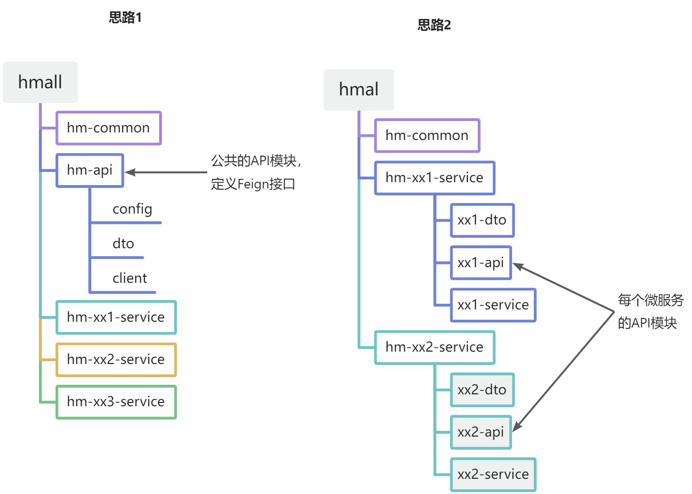
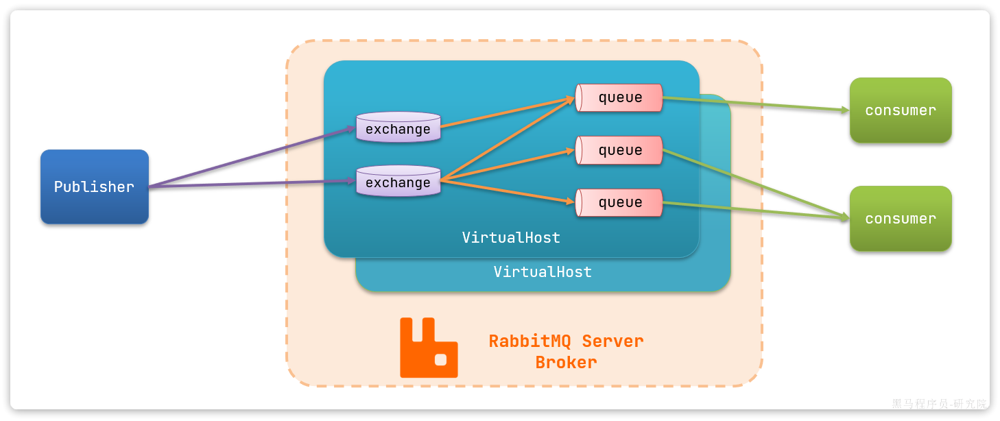
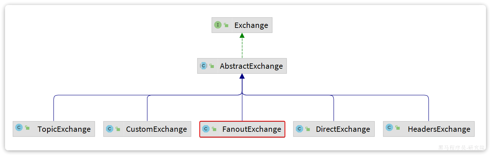
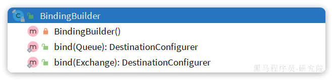
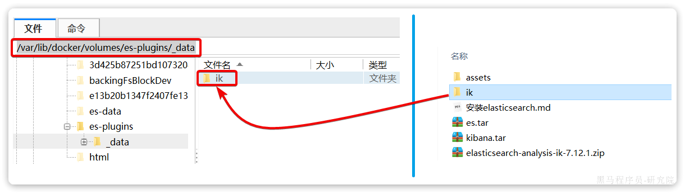
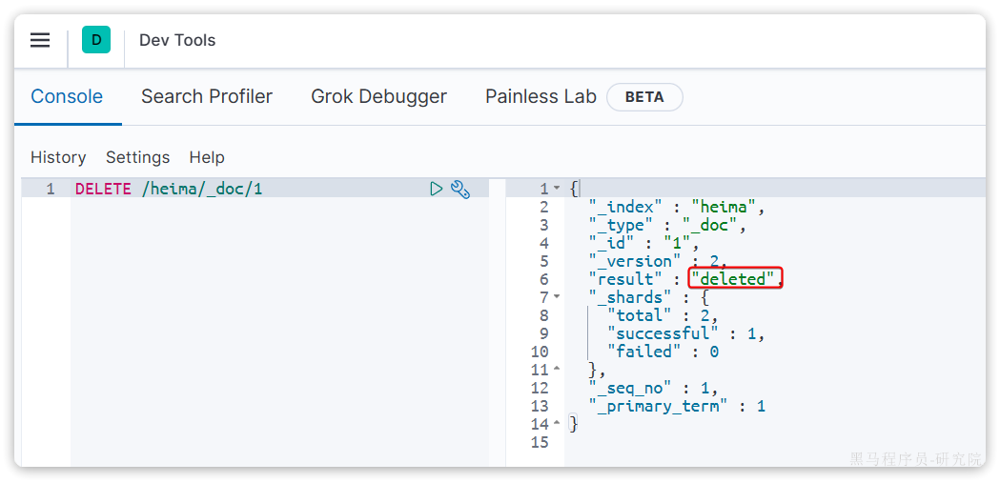
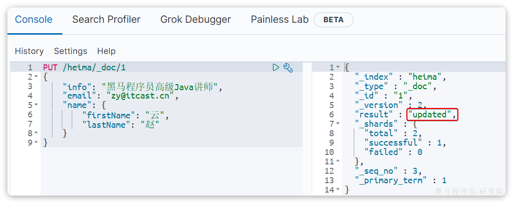

# Docker

Docker的常用命令参考：

[docker常规操作——启动、停止、重启容器实例_docker容器重启-CSDN博客](https://blog.csdn.net/Michel4Liu/article/details/80889977)

[docker查看容器/删除(所有)容器/删除镜像_查看docker删除运行的容实例-CSDN博客](https://blog.csdn.net/HYZX_9987/article/details/118999188)

[设置docker开机自启动，并设置容器自动重启_小雅全家桶容器重启-CSDN博客](https://blog.csdn.net/chj_1224365967/article/details/109029856)


# Spring Cloud


## 服务拆分

> - **高内聚**：每个微服务的职责要尽量单一，包含的业务相互关联度高、完整度高。
> - **低耦合**：每个微服务的功能要相对独立，尽量减少对其它微服务的依赖，或者依赖接口的稳定性要强。

> **高内聚**首先是**单一职责，**但不能说一个微服务就一个接口，而是要保证微服务内部业务的完整性为前提。目标是当我们要修改某个业务时，最好就只修改当前微服务，这样变更的成本更低。
>
> 一旦微服务做到了高内聚，那么服务之间的**耦合度**自然就降低了。
>
> 当然，微服务之间不可避免的会有或多或少的业务交互，比如下单时需要查询商品数据。这个时候我们不能在订单服务直接查询商品数据库，否则就导致了数据耦合。而应该由商品服务对应暴露接口，并且一定要保证微服务对外**接口的稳定性**（即：尽量保证接口外观不变）。虽然出现了服务间调用，但此时无论你如何在商品服务做内部修改，都不会影响到订单微服务，服务间的耦合度就降低了。

拆分方式有如下两种：

- **纵向**拆分
- **横向**拆分

> 所谓**纵向拆分**，就是按照项目的功能模块来拆分。例如黑马商城中，就有用户管理功能、订单管理功能、购物车功能、商品管理功能、支付功能等。那么按照功能模块将他们拆分为一个个服务，就属于纵向拆分。这种拆分模式可以尽可能提高服务的内聚性。
>
> 而**横向拆分**，是看各个功能模块之间有没有公共的业务部分，如果有将其抽取出来作为通用服务。例如用户登录是需要发送消息通知，记录风控数据，下单时也要发送短信，记录风控数据。因此消息发送、风控数据记录就是通用的业务功能，因此可以将他们分别抽取为公共服务：消息中心服务、风控管理服务。这样可以提高业务的复用性，避免重复开发。同时通用业务一般接口稳定性较强，也不会使服务之间过分耦合。


## 服务治理

拆分服务后，不同的模块的业务需求多数会与其他模块产生联系，此时需要远程调用其他模块的接口获取数据，较为原始的方法有RestTemplate，但其缺点在于代码死板，不能灵活变通，而且代码量大，所以引入注册中心的概念：通过注册中心将不同的模块引入，便于统一管理和调用。


### 注册中心

> 在微服务远程调用的过程中，包括两个角色：
>
> - 服务提供者：提供接口供其它微服务访问，比如`item-service`
> - 服务消费者：调用其它微服务提供的接口，比如`cart-service`


#### Nacos注册中心

阿里巴巴开发，目前被集成在SpringCloudAlibaba中，一般用于Java应用，同时还存在Eureka（Netflix公司出品），Consul（HashiCorp公司出品），均被集成再Spring Cloud中。


Nacos的使用十分简单，步骤如下：

- 引入依赖
- 配置Nacos地址
- 重启

引入Nacos依赖：

```XML
<!--nacos 服务注册发现-->
<dependency>
    <groupId>com.alibaba.cloud</groupId>
    <artifactId>spring-cloud-starter-alibaba-nacos-discovery</artifactId>
</dependency>
```

配置Nacos：

```YAML
spring:
  application:
    name: item-service # 服务名称
  cloud:
    nacos:
      server-addr: 192.168.150.101:8848 # nacos地址
```


## OpenFeign

> OpenFeign利用SpringMVC的相关注解来声明请求方式、请求路径、请求参数、返回值类型，然后基于动态代理帮我们生成远程调用的代码，而无需我们手动再编写，非常方便。


### 使用

#### 导入依赖

在`cart-service`服务的pom.xml中引入`OpenFeign`的依赖和`loadBalancer`依赖：

```XML
  <!--openFeign-->
  <dependency>
      <groupId>org.springframework.cloud</groupId>
      <artifactId>spring-cloud-starter-openfeign</artifactId>
  </dependency>
  <!--负载均衡器-->
  <dependency>
      <groupId>org.springframework.cloud</groupId>
      <artifactId>spring-cloud-starter-loadbalancer</artifactId>
  </dependency>
```


#### 启用OpenFeign

在启动类上添加注解`@EnableFeignClients`，启动OpenFeign功能：


#### 编写OpenFeign客户端

创建接口类，实现方式如Controller接口一致，无需实现。需要注意的是要使用`@FeignClient("服务名称")`为接口类声明服务名称。


### 连接池

Feign底层发起http请求，依赖于其它的框架。其底层支持的http客户端实现包括：

- HttpURLConnection：默认实现，不支持连接池
- Apache HttpClient ：支持连接池
- OKHttp：支持连接池

因此我们通常会使用带有连接池的客户端来代替默认的HttpURLConnection。比如，我们使用OK Http.

连接池可以优化OpenFeign的性能。


#### 引入依赖

```XML
<!--OK http 的依赖 -->
<dependency>
  <groupId>io.github.openfeign</groupId>
  <artifactId>feign-okhttp</artifactId>
</dependency>
```


#### 开启连接池

在`application.yml`配置文件中开启Feign的连接池功能：

```YAML
feign:
  okhttp:
    enabled: true # 开启OKHttp功能
```


### 最佳实践

对于某些客户端而言，其会被多个模块使用，这就造成了重复编码，应对的思路就是将重复的代码抽取出来，一般有两种方式：

- 思路1：抽取到微服务之外的公共module
- 思路2：每个微服务自己抽取一个module



两个方案之间的差别在于：

方案1抽取更加简单，工程结构也比较清晰，但缺点是整个项目耦合度偏高。

方案2抽取相对麻烦，工程结构相对更复杂，但服务之间耦合度降低。


个人看法：方案一便于维护


#### 抽取Feign客户端

1. 新建一个模块
2. 导入依赖
3. 建立domain类和client类
4. 在client类中编写接口

需要注意的是：当其他模块需要调用接口时，请求参数和返回参数的接值都需要使用该模块中的domain类中的类


#### 扫描包配置

调用API的模块扫描不到客户端，此时需要进行配置

- 声明扫描包：

​	在启动类上启用注解`@EnableFeignClients(basePackages = "Feign客户端所在包")`

- 声明要用的FeignClient

​	单独声明，`@EnablefeignClients(clients = {client1, client2,...})`


### 日志配置

> OpenFeign只会在FeignClient所在包的日志级别为**DEBUG**时，才会输出日志。而且其日志级别有4级：
>
> - **NONE**：不记录任何日志信息，这是默认值。
> - **BASIC**：仅记录请求的方法，URL以及响应状态码和执行时间
> - **HEADERS**：在BASIC的基础上，额外记录了请求和响应的头信息
> - **FULL**：记录所有请求和响应的明细，包括头信息、请求体、元数据。
>
> Feign默认的日志级别就是NONE，所以默认我们看不到请求日志。


##### 定义日志级别

定义一个config类，新建配置类，定义Feign的日志级别

```java
package com.qingmuy.api.config;

import feign.Logger;
import org.springframework.context.annotation.Bean;

public class DefaultFeignConfig {
    @Bean
    public Logger.Level feignLoggerLevel() {
        return Logger.Level.FULL;
    }
}
```


##### 配置

要让日志级别生效，还需要配置这个类。有两种方法：

- **局部**生效：在某个`FeignClient`中配置，只对当前`FeignClient`生效

```Java
@FeignClient(value = "item-service", configuration = DefaultFeignConfig.class)
```

- **全局**生效：在`@EnableFeignClients`中配置，针对所有`FeignClient`生效。

```Java
@EnableFeignClients(defaultConfiguration = DefaultFeignConfig.class)
```


## 网关路由

前端在于后端交互时，前端中的后端URI地址往往是写死的，这与微服务的多实例特性冲突，所以需要一个统一的地址来转发不同微服务之间的数据。


### 使用

大概步骤如下：

- 创建网关微服务
- 引入SpringCloudGateway、NacosDiscovery依赖
- 编写启动类
- 配置网关路由


#### 创建项目

创建一个新的模块，作为网关微服务


#### 引入依赖

在该模块下引入依赖：

```XML
<dependencies>
    <!--common-->
    <dependency>
        <groupId>com.heima</groupId>
        <artifactId>hm-common</artifactId>
        <version>1.0.0</version>
    </dependency>
    <!--网关-->
    <dependency>
        <groupId>org.springframework.cloud</groupId>
        <artifactId>spring-cloud-starter-gateway</artifactId>
    </dependency>
    <!--nacos discovery-->
    <dependency>
        <groupId>com.alibaba.cloud</groupId>
        <artifactId>spring-cloud-starter-alibaba-nacos-discovery</artifactId>
    </dependency>
    <!--负载均衡-->
    <dependency>
        <groupId>org.springframework.cloud</groupId>
        <artifactId>spring-cloud-starter-loadbalancer</artifactId>
    </dependency>
</dependencies>
```


#### 启动类

新建启动类


#### 配置路由

在`resources`目录下新建`application.yaml`文件，声明路由：

```YAML
server:
  port: 8080
spring:
  application:
    name: gateway
  cloud:
    nacos:
      server-addr: 192.168.150.101:8848
    gateway:
      routes:
        - id: item # 路由规则id，自定义，唯一
          uri: lb://item-service # 路由的目标服务，lb代表负载均衡，会从注册中心拉取服务列表
          predicates: # 路由断言，判断当前请求是否符合当前规则，符合则路由到目标服务
            - Path=/items/**,/search/** # 这里是以请求路径作为判断规则
        - id: cart
          uri: lb://cart-service
          predicates:
            - Path=/carts/**
        - id: user
          uri: lb://user-service
          predicates:
            - Path=/users/**,/addresses/**
        - id: trade
          uri: lb://trade-service
          predicates:
            - Path=/orders/**
        - id: pay
          uri: lb://pay-service
          predicates:
            - Path=/pay-orders/**
```


### 路由过滤

路由规则的定义语法如下：

```YAML
spring:
  cloud:
    gateway:
      routes:
        - id: item
          uri: lb://item-service
          predicates:
            - Path=/items/**,/search/**
```

`routes`是一个集合，即可以定义很多的路由规则，常见的属性如下：

- `id`：路由的唯一标示
- `predicates`：路由断言，其实就是匹配条件
- `filters`：路由过滤条件，后面讲
- `uri`：路由目标地址，`lb://`代表负载均衡，从注册中心获取目标微服务的实例列表，并且负载均衡选择一个访问。

对于`predicates`路由断言，SpringCloudGateway中支持的断言类型有很多：

| **名称**   | **说明**                       | **示例**                                                     |
| :--------- | :----------------------------- | :----------------------------------------------------------- |
| After      | 是某个时间点后的请求           | - After=2037-01-20T17:42:47.789-07:00[America/Denver]        |
| Before     | 是某个时间点之前的请求         | - Before=2031-04-13T15:14:47.433+08:00[Asia/Shanghai]        |
| Between    | 是某两个时间点之前的请求       | - Between=2037-01-20T17:42:47.789-07:00[America/Denver], 2037-01-21T17:42:47.789-07:00[America/Denver] |
| Cookie     | 请求必须包含某些cookie         | - Cookie=chocolate, ch.p                                     |
| Header     | 请求必须包含某些header         | - Header=X-Request-Id, \d+                                   |
| Host       | 请求必须是访问某个host（域名） | - Host=**.somehost.org,**.anotherhost.org                    |
| Method     | 请求方式必须是指定方式         | - Method=GET,POST                                            |
| Path       | 请求路径必须符合指定规则       | - Path=/red/{segment},/blue/**                               |
| Query      | 请求参数必须包含指定参数       | - Query=name, Jack或者- Query=name                           |
| RemoteAddr | 请求者的ip必须是指定范围       | - RemoteAddr=192.168.1.1/24                                  |
| weight     | 权重处理                       |                                                              |


### 网关登录校验

> 单体架构时我们只需要完成一次用户登录、身份校验，就可以在所有业务中获取到用户信息。而微服务拆分后，每个微服务都独立部署，不再共享数据。也就意味着每个微服务都需要做登录校验，这显然不可取。


如果每个微服务都做登录校验会存在两个问题：

- 每个微服务都需要知道JWT的秘钥，不安全
- 每个微服务重复编写登录校验代码、权限校验代码，麻烦


网关作为微服务的入口，一切请求皆需要首先经过网关，所以可以将登录校验交给网关做。此时校验流程如下：


此时仍存在一些问题：

- 网关路由是配置的，请求转发是Gateway内部代码，如何在转发之前做登录校验？
- 网关校验JWT之后，如何将用户信息传递给微服务？
- 微服务之间也会相互调用，这种调用不经过网关，又该如何传递用户信息？


#### 网关过滤器

> 登录校验必须在请求转发到微服务之前做，否则就失去了意义。而网关的请求转发是`Gateway`内部代码实现的，要想在请求转发之前做登录校验，就必须了解`Gateway`内部工作的基本原理。


如图所示，大致流程如下：

1. 客户端请求进入网关后由`HandlerMapping`对请求做判断，找到与当前请求匹配的路由规则（**`Route`**），然后将请求交给`WebHandler`去处理。
2. `WebHandler`则会加载当前路由下需要执行的过滤器链（**`Filter chain`**），然后按照顺序逐一执行过滤器（后面称为**`Filter`**）。
3. 图中`Filter`被虚线分为左右两部分，是因为`Filter`内部的逻辑分为`pre`和`post`两部分，分别会在请求路由到微服务**之前**和**之后**被执行。
4. 只有所有`Filter`的`pre`逻辑都依次顺序执行通过后，请求才会被路由到微服务。
5. 微服务返回结果后，再倒序执行`Filter`的`post`逻辑。
6. 最终把响应结果返回。


最终请求转发是有一个名为`NettyRoutingFilter`的过滤器来执行的，而且这个过滤器是整个过滤器链中顺序最靠后的一个。**需要定义一个过滤器，在其中实现登录校验逻辑，并且将过滤器执行顺序定义到**`NettyRoutingFilter`**之前**，即可符合需求。

问题在于如何实现一个网关过滤器？

网关过滤器链中的过滤器有两种：

- **`GatewayFilter`**：路由过滤器，作用范围比较灵活，可以是任意指定的路由`Route`. 
- **`GlobalFilter`**：全局过滤器，作用范围是所有路由，不可配置。

**注意**：过滤器链之外还有一种过滤器，HttpHeadersFilter，用来处理传递到下游微服务的请求头。例如org.springframework.cloud.gateway.filter.headers.XForwardedHeadersFilter可以传递代理请求原本的host头到下游微服务。


实际上`GatewayFilter`和`GlobalFilter`这两种过滤器的方法签名完全一致：

```Java
/**
 * 处理请求并将其传递给下一个过滤器
 * @param exchange 当前请求的上下文，其中包含request、response等各种数据
 * @param chain 过滤器链，基于它向下传递请求
 * @return 根据返回值标记当前请求是否被完成或拦截，chain.filter(exchange)就放行了。
 */
Mono<Void> filter(ServerWebExchange exchange, GatewayFilterChain chain);
```

`FilteringWebHandler`在处理请求时，会将`GlobalFilter`装饰为`GatewayFilter`，然后放到同一个过滤器链中，排序以后依次执行。


**注意**：`exchange`和`chain`两个参数

- `exchange`内部存放了当前请求的上下文，其中包含request、response等各种数据
- `chain`过滤器链，基于它向下传递请求


`Gateway`内置的`GatewayFilter`过滤器使用起来非常简单，无需编码，只要在yaml文件中简单配置即可。而且其作用范围也很灵活，配置在哪个`Route`下，就作用于哪个`Route`.


例如，有一个过滤器叫做`AddRequestHeaderGatewayFilterFacotry`，顾明思议，就是添加请求头的过滤器，可以给请求添加一个请求头并传递到下游微服务。

使用的使用只需要在application.yaml中这样配置：

```YAML
spring:
  cloud:
    gateway:
      routes:
      - id: test_route
        uri: lb://test-service
        predicates:
          -Path=/test/**
        filters:
          - AddRequestHeader=key, value # 逗号之前是请求头的key，逗号之后是value
```

如果想要让过滤器作用于所有的路由，则可以这样配置：

```YAML
spring:
  cloud:
    gateway:
      default-filters: # default-filters下的过滤器可以作用于所有路由
        - AddRequestHeader=key, value
      routes:
      - id: test_route
        uri: lb://test-service
        predicates:
          -Path=/test/**
```


#### 自定义过滤器

无论是`GatewayFilter`还是`GlobalFilter`都支持自定义，只不过**编码**方式、**使用**方式略有差别。


##### 自定义GatewayFilter

自定义`GatewayFilter`不是直接实现`GatewayFilter`，而是实现`AbstractGatewayFilterFactory`。最简单的方式是这样的：

```Java
@Component
public class PrintAnyGatewayFilterFactory extends AbstractGatewayFilterFactory<Object> {
    @Override
    public GatewayFilter apply(Object config) {
        return new GatewayFilter() {
            @Override
            public Mono<Void> filter(ServerWebExchange exchange, GatewayFilterChain chain) {
                // 获取请求
                ServerHttpRequest request = exchange.getRequest();
                // 编写过滤器逻辑
                System.out.println("过滤器执行了");
                // 放行
                return chain.filter(exchange);
            }
        };
    }
}
```

**注意**：该类的名称一定要以`GatewayFilterFactory`为后缀！

然后在yaml配置中这样使用：

```YAML
spring:
  cloud:
    gateway:
      default-filters:
            - PrintAny # 此处直接以自定义的GatewayFilterFactory类名称前缀类声明过滤器
```

这种过滤器还可以支持动态配置参数，不过实现起来比较复杂。


##### 自定义GlobalFilter

自定义GlobalFilter则简单很多，直接实现GlobalFilter即可，而且也无法设置动态参数：

```Java
@Component
public class PrintAnyGlobalFilter implements GlobalFilter, Ordered {
    @Override
    public Mono<Void> filter(ServerWebExchange exchange, GatewayFilterChain chain) {
        // 编写过滤器逻辑
        System.out.println("未登录，无法访问");
        // 放行
        // return chain.filter(exchange);

        // 拦截
        ServerHttpResponse response = exchange.getResponse();
        response.setRawStatusCode(401);
        return response.setComplete();
    }

    @Override
    public int getOrder() {
        // 过滤器执行顺序，值越小，优先级越高
        return 0;
    }
}
```


#### 登录校验

利用自定义`GlobalFilter`来完成登录校验。


##### JWT工具

- `AuthProperties`：配置登录校验需要拦截的路径，因为不是所有的路径都需要登录才能访问
- `JwtProperties`：定义与JWT工具有关的属性，比如秘钥文件位置
- `SecurityConfig`：工具的自动装配
- `JwtTool`：JWT工具，其中包含了校验和解析`token`的功能
- `hmall.jks`：秘钥文件

其中`AuthProperties`和`JwtProperties`所需的属性要在`application.yaml`中配置，即读取yaml文件中的配置。


##### 登录校验过滤器

1. 根据`exchange`获取`request`请求头
2. 从请求头中获取访问路径，判断是否需要拦截，无需拦截直接放行即可
3. 从`request`请求头中获取`token`

```java
String token = null;
List<String> headers = request.getHeaders().get("authorization");
if (headers != null && !headers.isEmpty()) {
    token = headers.get(0);
}
```

4. 解析校验`token`，解析失败则拦截该请求并直接返回`401`未登录状态码		

```java
// 解析失败，拦截并返回设置状态码为401
ServerHttpResponse response = exchange.getResponse();
response.setStatusCode(HttpStatus.UNAUTHORIZED);
return response.setComplete();
```

5. 传递用户信息

```java
String userInfo = userId.toString();
ServerWebExchange swe = exchange.mutate()
        .request(builder -> builder.header("user-info", userInfo))
        .build();
```

5. 放行


#### 微服务获取用户

网关获取用户数据之后，需要将用户数据转发给各个微服务，所以需要：

- 改造网关过滤器，在获取用户信息后保存到请求头，转发到下游微服务
- 编写微服务拦截器，拦截请求获取用户信息，保存到ThreadLocal后放行


##### 保存用户到请求头

在登录校验拦截器处修改逻辑将用户信息保存到请求头中：

```java
String userInfo = userId.toString();
ServerWebExchange swe = exchange.mutate()
        .request(builder -> builder.header("user-info", userInfo))
        .build();
```


##### 拦截器获取用户

由于每个微服务都有获取登录用户的需求，因此拦截器我们直接写在`hm-common`中，并写好自动装配。这样微服务只需要引入`hm-common`就可以直接具备拦截器功能，无需重复编写。

定义拦截器并编写逻辑：

```java
public class UserInfoInterceptor implements HandlerInterceptor {

    @Override
    public boolean preHandle(HttpServletRequest request, HttpServletResponse response, Object handler) throws Exception {
        // 1. 获取登录用户信息
        String userInfo = request.getHeader("user-info");
        // 2. 判断是否获取了用户，如果有则存入ThreadLocal
        if (StrUtil.isNotBlank(userInfo)) {
            UserContext.setUser(Long.valueOf(userInfo));
        }
        // 3. 放行
        return true;
    }

    @Override
    public void afterCompletion(HttpServletRequest request, HttpServletResponse response, Object handler, Exception ex) throws Exception {
        UserContext.removeUser();
    }
}
```

再编写配置类，将拦截器注册到配置中：

```java
@Configuration
@ConditionalOnClass(DispatcherServlet.class)
public class MvcConfig implements WebMvcConfigurer {
    @Override
    public void addInterceptors(InterceptorRegistry registry) {
        // 默认拦截所有路径
        registry.addInterceptor(new UserInfoInterceptor());
    }
}
```


需要注意的是，这个配置类默认是不会生效的，因为它所在的包是`com.hmall.common.config`，与其它微服务的扫描包不一致，无法被扫描到，因此无法生效。

基于SpringBoot的自动装配原理，我们要将其添加到`resources`目录下的`META-INF/spring.factories`文件中

```properties
org.springframework.boot.autoconfigure.EnableAutoConfiguration=\
  com.hmall.common.config.MyBatisConfig,\
  com.hmall.common.config.MvcConfig,\
  com.hmall.common.config.JsonConfig
```


#### openFeign传递用户

尽管上述的方法将用户信息存储在了线程中，但是对于一些复杂的业务：需要调用其他模块的业务而言，由于不同的实例间线程不一致，无法继续保存用户信息，所以需要**在微服务发起调用时把用户信息存入请求头**。


微服务之间调用是基于OpenFeign来实现的，并不是我们自己发送的请求。我们如何才能让每一个由OpenFeign发起的请求自动携带登录用户信息呢？

这里要借助Feign中提供的一个拦截器接口：`feign.RequestInterceptor`

```Java
public interface RequestInterceptor {

  /**
   * Called for every request. 
   * Add data using methods on the supplied {@link RequestTemplate}.
   */
  void apply(RequestTemplate template);
}
```


我们只需要实现这个接口，然后实现apply方法，利用`RequestTemplate`类来添加请求头，将用户信息保存到请求头中。这样以来，每次OpenFeign发起请求的时候都会调用该方法，传递用户信息。

将该拦截器的配置写入`FeignClient`的api模块中：

在`com.qingmuy.api.config.DefaultFeignConfig`中添加一个Bean：

```Java
@Bean
public RequestInterceptor userInfoRequestInterceptor(){
    return new RequestInterceptor() {
        @Override
        public void apply(RequestTemplate template) {
            // 获取登录用户
            Long userId = UserContext.getUser();
            if(userId == null) {
                // 如果为空则直接跳过
                return;
            }
            // 如果不为空则放入请求头中，传递给下游微服务
            template.header("user-info", userId.toString());
        }
    };
}
```


### 配置管理

微服务的多模块特性导致配置文件数量多，不易维护，可以通过Nacos的配置管理器服务统一管理。


微服务共享的配置可以统一交给Nacos保存和管理，在Nacos控制台修改配置后，Nacos会将配置变更推送给相关的微服务，并且无需重启即可生效，实现配置热更新。

网关的路由同样是配置，因此同样可以基于这个功能实现动态路由功能，无需重启网关即可修改路由配置。


#### 配置共享

我们可以把微服务共享的配置抽取到Nacos中统一管理，这样就不需要每个微服务都重复配置了。分为两步：

- 在Nacos中添加共享配置
- 微服务拉取配置


##### 添加共享配置

将配置文件中重复的部分抽取出来，在Nacos中的`配置管理`->`配置列表`中点击`+`新建一个配置，键入信息即可。

在可设定的参数的后方使用`:`连接默认设置，如

```yaml
username: ${muy.database.username:dingzhen}
```


##### 拉取共享配置

需要注意的是，读取Nacos配置是SpringCloud上下文（`ApplicationContext`）初始化时处理的，发生在项目的引导阶段。然后才会初始化SpringBoot上下文，去读取`application.yaml`。

也就是说引导阶段，`application.yaml`文件尚未读取，根本不知道nacos 地址，该如何去加载nacos中的配置文件呢？

SpringCloud在初始化上下文的时候会先读取一个名为`bootstrap.yaml`(或者`bootstrap.properties`)的文件，如果我们将nacos地址配置到`bootstrap.yaml`中，那么在项目引导阶段就可以读取nacos中的配置了。


因此，微服务整合Nacos配置管理的步骤如下：

1. 引入依赖：

在cart-service模块引入依赖：

```XML
  <!--nacos配置管理-->
  <dependency>
      <groupId>com.alibaba.cloud</groupId>
      <artifactId>spring-cloud-starter-alibaba-nacos-config</artifactId>
  </dependency>
  <!--读取bootstrap文件-->
  <dependency>
      <groupId>org.springframework.cloud</groupId>
      <artifactId>spring-cloud-starter-bootstrap</artifactId>
  </dependency>
```

2. 新建bootstrap.yaml

在cart-service中的resources目录新建一个bootstrap.yaml文件：


内容如下：

```YAML
spring:
  application:
    name: cart-service # 服务名称
  profiles:
    active: dev
  cloud:
    nacos:
      server-addr: 192.168.150.101 # nacos地址
      config:
        file-extension: yaml # 文件后缀名
        shared-configs: # 共享配置
          - dataId: shared-jdbc.yaml # 共享mybatis配置
          - dataId: shared-log.yaml # 共享日志配置
          - dataId: shared-swagger.yaml # 共享日志配置
```

3. 修改application.yaml

由于一些配置挪到了bootstrap.yaml，因此application.yaml需要修改为：

```YAML
server:
  port: 8082
feign:
  okhttp:
    enabled: true # 开启OKHttp连接池支持
hm:
  swagger:
    title: 购物车服务接口文档
    package: com.hmall.cart.controller
  db:
    database: hm-cart
```

重启服务，发现所有配置都生效了。


#### 配置热更新

当修改配置文件中的配置时，微服务无需重启即可使配置生效。

前提条件：

1. nacos中要有一个与微服务名有关的配置文件，命名格式为

[spring.application.name]-[spring.active.profile].[file-extension]

其中第一个字段微服务名称；第二个字段为项目profile，为可选参数；第三个字段为文件后缀名。

微服务在启动时会自动寻找相同名称的配置文件读取。

2. 微服务要以特定的方式读取需要热更新的配置属性

有两种配置方式：

一为直接读取配置文件：

```java
@Data
@ConfigurationProperties(prefix = "hm.cart")
public class CartProperties {
    private int maxItems;
}
```

另一种为使用注解标准热更新

```java
@Data
@RefreshScope
public class CartProperties {
    @Value("${hm.cart.maxItems}")
    private int maxItems;
}
```


#### 动态路由

要实现动态路由首先要将路由配置保存到Nacos，当Nacos中的路由配置变更时，推送最新配置到网关，实时更新网关中的路由信息。

我们需要完成两件事情:

1. 监听Nacos配置变更的消息
2. 当配置变更时，将最新的路由信息更新到网关路由表 


基于Nacos的源码[Java SDK (nacos.io)](https://nacos.io/zh-cn/docs/sdk.html)得知：Nacos会在项目启动时自动拉取配置并写入路由，而且可以自定义添加监听器。

所以可以在网关`Gateway`中新建一个`routers`包用于定义配置监听器：


配置动态路由需要两个必要的Bean组件，分别为：`NacosConfigManager`和`RouteDefinitionWriter`

其中`NacosConfigManager`用于控制Nacos配置监听器以及拉取配置更新；`RouteDefinitionWriter`用于将路由写入路由表或删除路由表。


首先控制路由的热更新，需要完成路由的更新操作，这就需要先完成路由表的初始化操作：初始化监听器

```java
@PostConstruct  // 在bean初始化时执行
    public void initRouteConfigListener() throws NacosException {
        // 项目启动时，先拉取一次配置，并且添加配置监听器
        String configInfo = nacosConfigManager.getConfigService()
                // 拉取配置并建立监听器
                .getConfigAndSignListener(dataId, group, 5000, new Listener() {

                    @Override
                    public Executor getExecutor() {
                        // 返回一个线程池：监听器的执行会异步执行
                        return null;
                    }

                    @Override
                    public void receiveConfigInfo(String configInfo) {
                        // 监听到配置变更， 需要去更新路由表
                        updateConfigInfo(configInfo);
                    }
                });
        // 第一次读取到配置，也需要更新到路由表
        updateConfigInfo(configInfo);
    }
```

`@PostConstruct`注解会在该组件类加载时先执行当前方法，这也就确保了初始化的完成。

通过`getConfigAndSignListener`方法可以实现拉取配置并建立监听器的操作，监听器`Listener`是一个接口，需要完成两个方法：`getExecutor`和`receiveConfigInfo`，其中`getExecutor`是返回一个线程池：便于在复杂业务时控制监听器；而`receiveConfigInfo`则会监听配置的更新并拉取配置信息。

拉取配置并建立监听器后需要更新到路由表，此时再利用`RouteDefinitionWriter`完成对路由表的操作。

```java
public void updateConfigInfo(String configInfo){
    log.info("监听到路由配置信息：{}", configInfo);
    // 1. 解析配置信息，转为RouteDefinition
    List<RouteDefinition> routeDefinitions = JSONUtil.toList(configInfo, RouteDefinition.class);
    // 2. 删除旧的路由表
    for (String routeId : routeIds) {
        writer.delete(Mono.just(routeId)).subscribe();
    }
    routeIds.clear();
    // 3. 更新路由表
    for (RouteDefinition routeDefinition : routeDefinitions) {
        // 更新路由表，将路由表转化为Mono类型
        writer.save(Mono.just(routeDefinition)).subscribe();    // subscribe会立即使更新生效：订阅
        // 记录路由id，便于下一次更新时删除
        routeIds.add(routeDefinition.getId());
    }
}
```

读取配置文件时，需要将配置文件解析，但是由于`yaml`配置文件不方便解析，所以将会使用`json`格式存储路由配置，故读取的配置文件为`json`类型，再将`json`文件读取并转换为列表类型即可。

对于路由表的更新操作，如果为增添路由，则将新的路由表写入即可，所以使用循环的方式全部写入，需要注意的是在写入时需要将`RouteDefinition`路由格式转为`Mono`格式，再调用`subscribe()`方法使更新立即生效。

而如果是删除路由操作，则需要删除全部的路由表再全部添加即可，而删除路由表需要逐个删除且使用的是路由的id，而当前并无方法获取路由表中路由的id，而在初始化的过程中会在第一次读取配置时调用更新路由方法，可以编写一个固定的`Set`集合用于存储路由的id，故当初始化时会记录各个路由id，后续更新操作均会保存路由id。


## 微服务保护和分布式事务


### 雪崩问题

微服务调用链路中的某个服务故障，引起整个链路中的所有微服务都不可用，这就是雪崩。


雪崩问题产生的原因是什么?

- 微服务相互调用，服务提供者出现故障或阻塞。
- 服务调用者没有做好异常处理，导致自身故障。
- 调用链中的所有服务级联失败，导致整个集群故障


解决问题的思路有哪些?

- 尽量避免服务出现故障或阻塞。
  - 保证代码的健壮性;
  - 保证网络畅通;
  - 能应对较高的并发请求;
- 服务调用者做好远程调用异常的后备方案，避免故障扩散


#### 解决方案

1. 请求限流：限制访问微服务的请求的并发量，避免服务因流量激增出现故障。

2. 线程隔离︰也叫做舱壁模式，模拟船舱隔板的防水原理。通过限定每个业务能使用的线程数量而将故障业务隔离，避免故障扩散。
3. 服务熔断:由断路器统计请求的异常比例或慢调用比例，如果超出阈值则会熔断该业务，则拦截该接口的请求。熔断期间，所有请求快速失败，全都走fallback逻辑。
4. 失败处理:定义fallback逻辑，让业务失败时不冉把出异吊，定及回默认数据或友好提示


##### 请求限流

服务故障最重要原因，就是并发太高！解决了这个问题，就能避免大部分故障。当然，接口的并发不是一直很高，而是突发的。因此请求限流，就是**限制或控制**接口访问的并发流量，避免服务因流量激增而出现故障。

请求限流往往会有一个限流器，数量高低起伏的并发请求曲线，经过限流器就变的非常平稳。这就像是水电站的大坝，起到蓄水的作用，可以通过开关控制水流出的大小，让下游水流始终维持在一个平稳的量。


##### 线程隔离

当一个业务接口响应时间长，而且并发高时，就可能耗尽服务器的线程资源，导致服务内的其它接口受到影响。所以我们必须把这种影响降低，或者缩减影响的范围。线程隔离正是解决这个问题的好办法。

线程隔离的思想来自轮船的舱壁模式：


轮船的船舱会被隔板分割为N个相互隔离的密闭舱，假如轮船触礁进水，只有损坏的部分密闭舱会进水，而其他舱由于相互隔离，并不会进水。这样就把进水控制在部分船体，避免了整个船舱进水而沉没。

为了避免某个接口故障或压力过大导致整个服务不可用，我们可以限定每个接口可以使用的资源范围，也就是将其“隔离”起来。


如图所示，我们给查询购物车业务限定可用线程数量上限为20，这样即便查询购物车的请求因为查询商品服务而出现故障，也不会导致服务器的线程资源被耗尽，不会影响到其它接口。

##### 服务熔断

线程隔离虽然避免了雪崩问题，但故障服务（商品服务）依然会拖慢购物车服务（服务调用方）的接口响应速度。而且商品查询的故障依然会导致查询购物车功能出现故障，购物车业务也变的不可用了。

所以，我们要做两件事情：

- **编写服务降级逻辑**：就是服务调用失败后的处理逻辑，根据业务场景，可以抛出异常，也可以返回友好提示或默认数据。
- **异常统计和熔断**：统计服务提供方的异常比例，当比例过高表明该接口会影响到其它服务，应该拒绝调用该接口，而是直接走降级逻辑。


# MQ


- 同步通讯：就如同打视频电话，双方的交互都是实时的。因此同一时刻你只能跟一个人打视频电话。
- 异步通讯：就如同发微信聊天，双方的交互不是实时的，你不需要立刻给对方回应。因此你可以多线操作，同时跟多人聊天。


## 基础

业务需要实时得到服务提供方的响应，则应该选择同步通讯（同步调用）。而如果追求更高的效率，并且不需要实时响应，则应该选择异步通讯（异步调用）。


### 同步调用

对于一个业务流程而言，多个微服务之间的调用就是同步通讯，必须等待上一个服务结束后才可以执行，这就导致：

- 拓展性差
- 性能下降
- 级联失败

所以需要使用异步调用代替同步调用


### 异步调用

异步调用方式其实就是基于消息通知的方式，一般包含三个角色：

- 消息发送者：投递消息的人，就是原来的调用方
- 消息Broker：管理、暂存、转发消息，你可以把它理解成微信服务器
- 消息接收者：接收和处理消息的人，就是原来的服务提供方


在异步调用中，发送者不再直接同步调用接收者的业务接口，而是发送一条消息投递给消息Broker。然后接收者根据自己的需求从消息Broker那里订阅消息。每当发送方发送消息后，接受者都能获取消息并处理。

这样，发送消息的人和接收消息的人就完全解耦了。


异步调用的优势包括：

- 耦合度更低
- 性能更好
- 业务拓展性强
- 故障隔离，避免级联失败

当然，异步通信也并非完美无缺，它存在下列缺点：

- 完全依赖于Broker的可靠性、安全性和性能
- 架构复杂，后期维护和调试麻烦


### 相关技术

消息Broker，目前常见的实现方案就是消息队列（MessageQueue），简称为MQ.

目比较常见的MQ实现：

- ActiveMQ
- RabbitMQ
- RocketMQ
- Kafka

几种常见MQ的对比：

|            | RabbitMQ                | ActiveMQ                       | RocketMQ   | Kafka      |
| ---------- | ----------------------- | ------------------------------ | ---------- | ---------- |
| 公司/社区  | Rabbit                  | Apache                         | 阿里       | Apache     |
| 开发语言   | Erlang                  | Java                           | Java       | Scala&Java |
| 协议支持   | AMQP，XMPP，SMTP，STOMP | OpenWire,STOMP，REST,XMPP,AMQP | 自定义协议 | 自定义协议 |
| 可用性     | 高                      | 一般                           | 高         | 高         |
| 单机吞吐量 | 一般                    | 差                             | 高         | 非常高     |
| 消息延迟   | 微秒级                  | 毫秒级                         | 毫秒级     | 毫秒以内   |
| 消息可靠性 | 高                      | 一般                           | 高         | 一般       |

追求可用性：Kafka、 RocketMQ 、RabbitMQ

追求可靠性：RabbitMQ、RocketMQ

追求吞吐能力：RocketMQ、Kafka

追求消息低延迟：RabbitMQ、Kafka


## RabbitMQ

RabbitMQ是基于Erlang语言开发的开源消息通信中间件，官网地址：

https://www.rabbitmq.com/


### 安装

基于Docker安装RabbitMQ

```shell
docker run \
 -e RABBITMQ_DEFAULT_USER=itheima \
 -e RABBITMQ_DEFAULT_PASS=123321 \
 -v mq-plugins:/plugins \
 --name mq \
 --hostname mq \
 -p 15672:15672 \
 -p 5672:5672 \
 --network hm-net\
 -d \
 rabbitmq:3.8-management
```


RabbitMQ对应的架构如图：



其中包含几个概念：

- **`publisher`**：生产者，也就是发送消息的一方
- **`consumer`**：消费者，也就是消费消息的一方
- **`queue`**：队列，存储消息。生产者投递的消息会暂存在消息队列中，等待消费者处理
- **`exchange`**：交换机，负责消息路由。生产者发送的消息由交换机决定投递到哪个队列。
- **`virtual host`**：虚拟主机，起到数据隔离的作用。每个虚拟主机相互独立，有各自的exchange、queue


### 收发消息

#### 交换机

可以使用交换机给队列发送消息，需要注意的是**交换机没有存储消息的能力**。


#### 队列

队列需要与交换机绑定后才能收发消息。


#### 绑定关系

点击`Exchanges`选项卡，点击对应交换机，进入交换机详情页，然后点击`Bindings`菜单，在表单中填写要绑定的队列名称，点击`bind`绑定即可。


### 数据隔离

#### 用户管理

- `Name`：也就是用户名
- `Tags`：`administrator`，说明`itheima`用户是超级管理员，拥有所有权限
- `Can access virtual host`： `/`，可以访问的`virtual host`，这里的`/`是默认的`virtual host`

对于小型企业而言，出于成本考虑，我们通常只会搭建一套MQ集群，公司内的多个不同项目同时使用。这个时候为了避免互相干扰， 我们会利用`virtual host`的隔离特性，将不同项目隔离。一般会做两件事情：

- 给每个项目创建独立的运维账号，将管理权限分离。
- 给每个项目创建不同的`virtual host`，将每个项目的数据隔离。


#### virtual host

基于`virtual host `实现了隔离效果。


## SpringAMOP

### 导入依赖

```XML
<?xml version="1.0" encoding="UTF-8"?>
<project xmlns="http://maven.apache.org/POM/4.0.0"
         xmlns:xsi="http://www.w3.org/2001/XMLSchema-instance"
         xsi:schemaLocation="http://maven.apache.org/POM/4.0.0 http://maven.apache.org/xsd/maven-4.0.0.xsd">
    <modelVersion>4.0.0</modelVersion>

    <groupId>cn.itcast.demo</groupId>
    <artifactId>mq-demo</artifactId>
    <version>1.0-SNAPSHOT</version>
    <modules>
        <module>publisher</module>
        <module>consumer</module>
    </modules>
    <packaging>pom</packaging>

    <parent>
        <groupId>org.springframework.boot</groupId>
        <artifactId>spring-boot-starter-parent</artifactId>
        <version>2.7.12</version>
        <relativePath/>
    </parent>

    <properties>
        <maven.compiler.source>8</maven.compiler.source>
        <maven.compiler.target>8</maven.compiler.target>
    </properties>

    <dependencies>
        <dependency>
            <groupId>org.projectlombok</groupId>
            <artifactId>lombok</artifactId>
        </dependency>
        <!--AMQP依赖，包含RabbitMQ-->
        <dependency>
            <groupId>org.springframework.boot</groupId>
            <artifactId>spring-boot-starter-amqp</artifactId>
        </dependency>
        <!--单元测试-->
        <dependency>
            <groupId>org.springframework.boot</groupId>
            <artifactId>spring-boot-starter-test</artifactId>
        </dependency>
    </dependencies>
</project>
```


### 基础使用


#### 消息发送

首先配置MQ地址，在`publisher`服务的`application.yml`中添加配置：

```YAML
spring:
  rabbitmq:
    host: 192.168.150.101 # 你的虚拟机IP
    port: 5672 # 端口
    virtual-host: /hmall # 虚拟主机
    username: hmall # 用户名
    password: 123 # 密码
```

然后在`publisher`服务中编写测试类`SpringAmqpTest`，并利用`RabbitTemplate`实现消息发送：

```Java
package com.itheima.publisher.amqp;

import org.junit.jupiter.api.Test;
import org.springframework.amqp.rabbit.core.RabbitTemplate;
import org.springframework.beans.factory.annotation.Autowired;
import org.springframework.boot.test.context.SpringBootTest;

@SpringBootTest
public class SpringAmqpTest {

    @Autowired
    private RabbitTemplate rabbitTemplate;

    @Test
    public void testSimpleQueue() {
        // 队列名称
        String queueName = "simple.queue";
        // 消息
        String message = "hello, spring amqp!";
        // 发送消息
        rabbitTemplate.convertAndSend(queueName, message);
    }
}
```


#### 消息接收

首先配置MQ地址，在`consumer`服务的`application.yml`中添加配置：

```YAML
spring:
  rabbitmq:
    host: 192.168.150.101 # 你的虚拟机IP
    port: 5672 # 端口
    virtual-host: /hmall # 虚拟主机
    username: hmall # 用户名
    password: 123 # 密码
```

然后在`consumer`服务的`com.itheima.consumer.listener`包中新建一个类`SpringRabbitListener`，代码如下：

```Java
package com.itheima.consumer.listener;

import org.springframework.amqp.rabbit.annotation.RabbitListener;
import org.springframework.stereotype.Component;

@Component
public class SpringRabbitListener {
        // 利用RabbitListener来声明要监听的队列信息
    // 将来一旦监听的队列中有了消息，就会推送给当前服务，调用当前方法，处理消息。
    // 可以看到方法体中接收的就是消息体的内容
    @RabbitListener(queues = "simple.queue")
    public void listenSimpleQueueMessage(String msg) throws InterruptedException {
        System.out.println("spring 消费者接收到消息：【" + msg + "】");
    }
}
```


### WorkQueues模型

Work queues，任务模型。简单来说就是**让****多个消费者****绑定到一个队列，共同消费队列中的消息**。

暂时无法在飞书文档外展示此内容

当消息处理比较耗时的时候，可能生产消息的速度会远远大于消息的消费速度。长此以往，消息就会堆积越来越多，无法及时处理。

此时就可以使用work 模型，**多个消费者共同处理消息处理，消息处理的速度就能大大提高**了。


但是默认的配置有如下问题：

消息是平均分配给每个消费者，并没有考虑到消费者的处理能力。导致1个消费者空闲，另一个消费者忙的不可开交。没有充分利用每一个消费者的能力，最终消息处理的耗时很长。这样显然是有问题的。


在spring中有一个简单的配置，可以解决这个问题。修改consumer服务的application.yml文件，添加配置：

```YAML
spring:
  rabbitmq:
    listener:
      simple:
        prefetch: 1 # 每次只能获取一条消息，处理完成才能获取下一个消息
```


Work模型的使用：

- 多个消费者绑定到一个队列，同一条消息只会被一个消费者处理
- 通过设置prefetch来控制消费者预取的消息数量


### 交换机类型

引入交换机，消息发送的模式会有很大变化：


可以看到，在订阅模型中，多了一个exchange角色，而且过程略有变化：

- **Publisher**：生产者，不再发送消息到队列中，而是发给交换机
- **Exchange**：交换机，一方面，接收生产者发送的消息。另一方面，知道如何处理消息，例如递交给某个特别队列、递交给所有队列、或是将消息丢弃。到底如何操作，取决于Exchange的类型。
- **Queue**：消息队列也与以前一样，接收消息、缓存消息。不过队列一定要与交换机绑定。
- **Consumer**：消费者，与以前一样，订阅队列，没有变化

**Exchange（****交换机****）只负责转发消息，不具备存储消息的能力**，因此如果没有任何队列与Exchange绑定，或者没有符合路由规则的队列，那么消息会丢失！

交换机的类型有四种：

- **Fanout**：广播，将消息交给所有绑定到交换机的队列。我们最早在控制台使用的正是Fanout交换机
- **Direct**：订阅，基于RoutingKey（路由key）发送给订阅了消息的队列
- **Topic**：通配符订阅，与Direct类似，只不过RoutingKey可以使用通配符
- **Headers**：头匹配，基于MQ的消息头匹配，用的较少。


### Fanout交换机

Fanout可以理解为广播。


在广播模式下，消息发送流程是这样的：


- 1）  可以有多个队列
- 2）  每个队列都要绑定到Exchange（交换机）
- 3）  生产者发送的消息，只能发送到交换机
- 4）  交换机把消息发送给绑定过的所有队列
- 5）  订阅队列的消费者都能拿到消息


交换机的作用如下：

- 接收publisher发送的消息
- 将消息按照规则路由到与之绑定的队列
- 不能缓存消息，路由失败，消息丢失
- FanoutExchange的会将消息路由到每个绑定的队列


### Direct交换机

在Fanout模式中，一条消息，会被所有订阅的队列都消费。但是，在某些场景下，我们希望不同的消息被不同的队列消费。这时就要用到Direct类型的Exchange。


在Direct模型下：

- 队列与交换机的绑定，不能是任意绑定了，而是要指定一个`RoutingKey`（路由key）
- 消息的发送方在 向 Exchange发送消息时，也必须指定消息的 `RoutingKey`。
- Exchange不再把消息交给每一个绑定的队列，而是根据消息的`Routing Key`进行判断，只有队列的`Routingkey`与消息的 `Routing key`完全一致，才会接收到消息


描述下Direct交换机与Fanout交换机的差异：

- Fanout交换机将消息路由给每一个与之绑定的队列
- Direct交换机根据RoutingKey判断路由给哪个队列
- 如果多个队列具有相同的RoutingKey，则与Fanout功能类似


### Topic交换机

`Topic`类型的`Exchange`与`Direct`相比，都是可以根据`RoutingKey`把消息路由到不同的队列。

只不过`Topic`类型`Exchange`可以让队列在绑定`BindingKey` 的时候使用通配符！

```
BindingKey` 一般都是有一个或多个单词组成，多个单词之间以`.`分割，例如： `item.insert
```

通配符规则：

- `#`：匹配一个或多个词
- `*`：匹配不多不少恰好1个词


描述下Direct交换机与Topic交换机的差异：

- Topic交换机接收的消息RoutingKey必须是多个单词，以 **`.`** 分割
- Topic交换机与队列绑定时的bindingKey可以指定通配符
- `#`：代表0个或多个词
- `*`：代表1个词


### 声明式交换机

个人手动在控制台创建交换机、队列和绑定关系往往是容易出错的，所以应该在程序中声明相应的实体和关系。


#### 基本API

SpringAMQP提供了一个Queue类，用来创建队列：


SpringAMQP还提供了一个Exchange接口，来表示所有不同类型的交换机：



SpringAMQP还提供了ExchangeBuilder来简化这个过程


而在绑定队列和交换机时，则需要使用BindingBuilder来创建Binding对象：




#### 基于注解声明

上述使用基本API并使用@Bean注解的方式声明队列和交换机十分繁琐，可以通过基于注解方式来声明。

使用格式为：

```java
@RabbitListener(bindings = @QueueBinding(
    value = @Queue(name = "direct.queue1"),
    exchange = @Exchange(name = "hmall.direct", type = ExchangeTypes.DIRECT),
    key = {"red", "blue"}
))
```


### 消息转换器

Spring的消息发送代码接收的消息体是一个Object：


而在数据传输时，它会把你发送的消息序列化为字节发送给MQ，接收消息的时候，还会把字节反序列化为Java对象。

只不过，默认情况下Spring采用的序列化方式是JDK序列化。众所周知，JDK序列化存在下列问题：

- 数据体积过大
- 有安全漏洞
- 可读性差


#### 配置JSON转换器

所以JDK序列化方式并不合适。应当使消息体的体积更小、可读性更高，因此可以使用JSON方式来做序列化和反序列化。


在消息发送方和接收方都引入依赖：

```XML
<dependency>
    <groupId>com.fasterxml.jackson.dataformat</groupId>
    <artifactId>jackson-dataformat-xml</artifactId>
    <version>2.9.10</version>
</dependency>
```


配置消息转换器，在`publisher`和`consumer`两个服务的启动类中添加一个Bean即可：

```Java
@Bean
public MessageConverter messageConverter(){
    // 1.定义消息转换器
    Jackson2JsonMessageConverter jackson2JsonMessageConverter = new Jackson2JsonMessageConverter();
    // 2.配置自动创建消息id，用于识别不同消息，也可以在业务中基于ID判断是否是重复消息
    jackson2JsonMessageConverter.setCreateMessageIds(true);
    return jackson2JsonMessageConverter;
}
```

消息转换器中添加的messageId可以便于我们将来做幂等性判断。


#### 消费者接收Object

消息的接收方接收消息时，要使用与发送方相同的格式接收。

消息接收时，需要使用`@RabbitListener`注解监听指定队列。


### MessageProperties

`RabbitTemplate`的发送的消息对象称之为`message`，而Message对象实际上携带了额外的`properties`参数，可以使用`properties`传递必要的参数，就类似于Http请求中的头部数据。

> 可以通过调用 `setHeader(String key, Object value)` 方法用用户定义的 'header' 来扩展这些属性。

也就是说可以使用header存储userId，具体实现方法是在`converAndSend`方法后再加一个匿名对象MessagePostProcessor，内部重写`postProcessMessage`方法：在内部使用setHeader方法将userId存入。实现如下：

```java
rabbitTemplate.convertAndSend("trade.topic", "order.create", itemIds, new MessagePostProcessor() {
    @Override
    public Message postProcessMessage(Message message) throws AmqpException {
        message.getMessageProperties().setHeader("userId", UserContext.getUser());
        return message;
    }
});
```

使用Lambda表达式简化后如下：

```java
rabbitTemplate.convertAndSend("trade.topic", "order.create", itemIds, message -> {
    message.getMessageProperties().setHeader("userId", UserContext.getUser());
    return message;
});
```

上述方法虽然解决了传递问题，但是实际上，很多service层中的方法的参数都不包含userId，这是因为userid往往被存于`ThreadLocal`中，随用随取。所以需要将userId存入`ThreadLocal`之中，而如果每次Listener都添加一次又十分繁琐，所以应该设计一个方法使得userId自动被存于`ThreadLocal`之中。

一个解决办法就是：通过重写消息转化器的`fromMessage`方法，使得每次消费者接收消息完成反序列化时自动将userId存于`TreadLocal`之中。该方法作为共有的配置类，存放于common模块下（这种共有的配置类一般会存放于一个普通的模块下）。具体实现如下：

```java
@Configuration
public class MqConfig {
    @Bean
    public MessageConverter messageConverter(){
        // 1.定义消息转换器
        Jackson2JsonMessageConverter jackson2JsonMessageConverter = new Jackson2JsonMessageConverter(){
            @Override
            public Object fromMessage(Message message) throws MessageConversionException {
                Long userId = message.getMessageProperties().getHeader("userId");
                if (ObjectUtil.isNotNull(userId)) {
                    UserContext.setUser(userId);
                }
                return super.fromMessage(message);
            }
        };
        // 2.配置自动创建消息id，用于识别不同消息，也可以在业务中基于ID判断是否是重复消息
        jackson2JsonMessageConverter.setCreateMessageIds(true);
        return jackson2JsonMessageConverter;
    }
}
```

该方法源于：https://b11et3un53m.feishu.cn/wiki/OQH4weMbcimUSLkIzD6cCpN0nvc?comment_id=7381508989902684163&comment_type=0&comment_anchor=true


## 发送者的可靠性

实际上在开发中消息存在丢失的可能，大致分为以下几种情况：

- 发送消息时丢失：
  - 生产者发送消息时连接MQ失败
  - 生产者发送消息到达MQ后未找到`Exchange`
  - 生产者发送消息到达MQ的`Exchange`后，未找到合适的`Queue`
  - 消息到达MQ后，处理消息的进程发生异常
- MQ导致消息丢失：
  - 消息到达MQ，保存到队列后，尚未消费就突然宕机
- 消费者处理消息时：
  - 消息接收后尚未处理突然宕机
  - 消息接收后处理过程中抛出异常


为了避免消息丢失，维护MQ的可靠性，需要保证：

- 确保生产者一定把消息发送到MQ
- 确保MQ不会将消息弄丢
- 确保消费者一定要处理消息


### 生产者重试机制

针对发送者发送消息时因为网络故障导致与MQ的连接中断。SpringAMQP提供了消息发送时的重试机制，即：当`RabbitTemplate`与MQ连接超时后，多次重试。

修改`publisher`模块的`application.yaml`文件，添加下面的内容：

```YAML
spring:
  rabbitmq:
    connection-timeout: 1s # 设置MQ的连接超时时间
    template:
      retry:
        enabled: true # 开启超时重试机制
        initial-interval: 1000ms # 失败后的初始等待时间
        multiplier: 1 # 失败后下次的等待时长倍数，下次等待时长 = initial-interval * multiplier
        max-attempts: 3 # 最大重试次数
```

**注意**：当网络不稳定的时候，利用重试机制可以有效提高消息发送的成功率。不过SpringAMQP提供的重试机制是**阻塞式**的重试，也就是说多次重试等待的过程中，当前线程是被阻塞的。

如果对于业务性能有要求，建议禁用重试机制。如果一定要使用，请合理配置等待时长和重试次数，当然也可以考虑使用异步线程来执行发送消息的代码。


### 生产者确认机制

一般情况下不会出现因为网络导致的消息丢失，这种情况往往是无法预料的：比如物理网络问题、服务器提供商的问题、网络受到黑客攻击，不过少数情况下会产生消息发送到MQ之后丢失的现象，如：

- MQ内部处理消息的进程发生了异常
- 生产者发送消息到达MQ后未找到`Exchange`
- 生产者发送消息到达MQ的`Exchange`后，未找到合适的`Queue`，因此无法路由

针对上述情况，RabbitMQ提供了生产者消息确认机制，包括`Publisher Confirm`和`Publisher Return`两种。在开启确认机制的情况下，当生产者发送消息给MQ后，MQ会根据消息处理的情况返回不同的**回执**。

如图所示：


总结：

- 当消息投递到MQ，但是路由失败时，通过**Publisher Return**返回异常信息，同时返回ack的确认信息，代表投递成功
- 临时消息投递到了MQ，并且入队成功，返回`ACK`，告知投递成功
- 持久消息投递到了MQ，并且入队完成持久化，返回`ACK` ，告知投递成功
- 其它情况都会返回`NACK`，告知投递失败

其中`ack`和`nack`属于**Publisher Confirm**机制，`ack`是投递成功；`nack`是投递失败。而`return`则属于**Publisher Return**机制。

默认两种机制都是关闭状态，需要通过配置文件来开启。


#### 个人理解

对于`Confirm`机制而言，其仅仅确保了消息路由到（发送到）`Broker`，如成功传递到`Broker`则`broker`会给生产者一个应答来确定收到消息，生产者接收应答之后可以确定该消息是否正确发送到`Broker`，所以该机制仅能保证消息被`Broker`接收而不能确定消息是否路由到了正确到`exchange`或`queue`，若传递成功即返回`ACK`，传递不成功则返回`NACK`。（所谓broker是消息队列的核心组件之一，它的作用是接收、存储、分发和传递消息。）


对于`Return`机制而言，它能确定消息是否正确路由到`queue`。该机制会返回错误的信息供后续逻辑处理。这也是为什么即便`exchange`没有绑定`queue`也仍然会返回投递成功而会通过`returrn`机制处理错误信息。


**注意**：

开启生产者确认比较消耗MQ性能，一般不建议开启。而且大家思考一下触发确认的几种情况：

- 路由失败：一般是因为RoutingKey错误导致，往往是编程导致
- 交换机名称错误：同样是编程错误导致
- MQ内部故障：这种需要处理，但概率往往较低。因此只有对消息可靠性要求非常高的业务才需要开启，而且仅仅需要开启ConfirmCallback处理nack就可以了。


### 实现生产者确认

#### 开启生产者确认

在`application.yaml`中添加如下配置：

```yaml
spring:
  rabbitmq:
    publisher-confirm-type: correlated # 开启publisher confirm机制，并设置confirm类型
    publisher-returns: true # 开启publisher return机制
```

此处`publisher-confirm-type`有三种模式可选：

- `none`：关闭confirm机制
- `simple`：同步阻塞等待MQ的回执
- `correlated`：MQ异步回调返回回执

一般使用`correlated`回调机制。


#### 定义ReturnCallback

每个`RabbitTemplate`只能配置一个`ReturnCallback`，所以应该在公共配置类中统一进行定义，内容如下：

```Java
@Slf4j
@AllArgsConstructor
@Configuration
public class MqConfig {
    private final RabbitTemplate rabbitTemplate;

    @PostConstruct
    public void init(){
        rabbitTemplate.setReturnsCallback(new RabbitTemplate.ReturnsCallback() {
            @Override
            public void returnedMessage(ReturnedMessage returned) {
                log.error("触发return callback,");
                log.debug("exchange: {}", returned.getExchange());
                log.debug("routingKey: {}", returned.getRoutingKey());
                log.debug("message: {}", returned.getMessage());
                log.debug("replyCode: {}", returned.getReplyCode());
                log.debug("replyText: {}", returned.getReplyText());
            }
        });
    }
}
```

`@PostConstruct`注解：主要用于类, 在bean被创建并完成属性注入后，执行一些初始化操作(带有@PostConstruct注解的方法会被自动调用。)


#### 定义ConfirmCallback

由于每个消息发送时的处理逻辑不一定相同，因此`ConfirmCallback`需要在每次发消息时单独定义：而`rabbitTemplate`的`converAndSend`方法则需要多传递一个参数，即`ConfirmCallback`


此处的`CorrelationData`中包含两个核心的属性：

- `id`：消息的唯一标示，MQ对不同的消息的回执以此做判断，避免混淆
- `SettableListenableFuture`：回执结果的Future对象

在配置后，MQ的回执就会通过这个`Future`来返回，所以可以提前给`CorrelationData`中的`Future`添加回调函数来处理消息回执：


## MQ的可靠性

消息到达MQ后，若MQ没有保存数据，消息也可能丢失，所以要实现MQ的可靠性。


### 数据持久化

在RabbitMQ的`3.12`版本之前，RabbitMQ默认将接收到的消息保存在内存中，这样提高了消息的处理速度、降低了消息收发的延迟，但是这会导致两个问题：

- 一旦MQ宕机，内存中数据会丢失。
- 内存空间有限，若消费者产生故障或处理速度过慢会导致消息挤压进而引发MQ阻塞。

为了保证数据的可靠性，必须配置数据持久化，包括：

- 交换机持久化
- 队列持久化
- 消息持久化


#### 交换机持久化

在控制台的`Exchanges`页面，添加交换机时可以配置交换机的`Durability`参数：


设置为`Durable`就是持久化模式，`Transient`就是临时模式。


#### 队列持久化

在控制台的Queues页面，添加队列时，同样可以配置队列的`Durability`参数：


#### 消息持久化

**注意**：在SpringAMQP中默认发送持久化消息，而在控制台中默认发送非持久化消息。

**说明**：在开启持久化机制以后，如果同时还开启了生产者确认，那么MQ会在消息持久化以后才发送ACK回执，进一步确保消息的可靠性。

不过出于性能考虑，为了减少IO次数，发送到MQ的消息并不是逐条持久化到数据库的，而是每隔一段时间批量持久化。一般间隔在100毫秒左右，这就会导致ACK有一定的延迟，因此建议生产者确认全部采用异步方式。


### LazyMode

一旦出现消息堆积问题，RabbitMQ的内存占用就会越来越高，直到触发内存预警上限。此时RabbitMQ会将内存消息刷到磁盘上，这个行为成为`PageOut`。`PageOut`会耗费一段时间，并且会阻塞队列进程。因此在这个过程中RabbitMQ不会再处理新的消息，生产者的所有请求都会被阻塞。


在RabbitMQ的`3.6.0`版本开始，增加了`Lazy Queues`的模式，即`惰性队列`，其特性如下：

- 接收到消息后直接存入磁盘而非内存
- 消费者要消费消息时才会从磁盘中读取并加载到内存（也就是懒加载）
- 支持数百万条的消息存储


**注意**：在3.12版本之后，LazyQueue已经成为所有队列的默认格式。因此官方推荐升级MQ为3.12版本或者所有队列都设置为LazyQueue模式。


#### 控制台配置Lazy模式

在添加队列的时候，添加`x-queue-mod=lazy`参数即可设置队列为Lazy模式：


#### 代码配置Lazy模式

在利用SpringAMQP声明队列的时候，添加`x-queue-mod=lazy`参数也可设置队列为Lazy模式：

```Java
@Bean
public Queue lazyQueue(){
    return QueueBuilder
            .durable("lazy.queue")
            .lazy() // 开启Lazy模式
            .build();
}
```

这里是通过`QueueBuilder`的`lazy()`函数配置Lazy模式，底层源码如下：


当然，我们也可以基于注解来声明队列并设置为Lazy模式：

```Java
@RabbitListener(queuesToDeclare = @Queue(
        name = "lazy.queue",
        durable = "true",
        arguments = @Argument(name = "x-queue-mode", value = "lazy")
))
public void listenLazyQueue(String msg){
    log.info("接收到 lazy.queue的消息：{}", msg);
}
```


#### 更新已有队列为lazy模式

建议使用控制台直接修改。也可以使用命令行设置，不过较为繁琐，如下：

```Shell
rabbitmqctl set_policy Lazy "^lazy-queue$" '{"queue-mode":"lazy"}' --apply-to queues  
```


## 消费者可靠性

当RabbitMQ向消费者投递消息以后，需要知道消费者的处理状态如何。因为消息投递给消费者并不代表就一定被正确消费了，可能出现的故障有很多，比如：

- 消息投递的过程中出现了网络故障
- 消费者接收到消息后突然宕机
- 消费者接收到消息后，因处理不当导致异常
- ...

一旦发生上述情况，消息也会丢失。因此，RabbitMQ必须知道消费者的处理状态，一旦消息处理失败才能重新投递消息。


###  消费者确认机制

为了确认消费者是否成功处理消息，RabbitMQ提供了消费者确认机制（**Consumer Acknowledgement**）。即：当消费者处理消息结束后，应该向RabbitMQ发送一个回执，告知RabbitMQ自己消息处理状态。回执有三种可选值：

- ack：成功处理消息，RabbitMQ从队列中删除该消息
- nack：消息处理失败，RabbitMQ需要再次投递消息
- reject：消息处理失败并拒绝该消息，RabbitMQ从队列中删除该消息

一般reject方式用的较少，其出现的原因一般是消息格式有问题，即消息无法被正常转换，这并不属于业务的异常。因此大多数情况下需要将消息处理的代码通过`try catch`机制捕获，消息处理成功时返回ack，处理失败时返回nack。

由于消息回执的处理代码比较统一，因此SpringAMQP实现了消息确认。并允许通过配置文件设置ACK处理方式，有三种模式：

- **`none`**：不处理。即消息投递给消费者后立刻ack，消息会立刻从MQ删除。非常不安全，不建议使用
- **`manual`**：手动模式。需要自己在业务代码中调用api，发送`ack`或`reject`，存在业务入侵，但更灵活
- **`auto`**：自动模式。SpringAMQP利用AOP对我们的消息处理逻辑做了环绕增强，当业务正常执行时则自动返回`ack`.  当业务出现异常时，根据异常判断返回不同结果：
  - 如果是**业务异常**，会自动返回`nack`；
  - 如果是**消息处理或校验异常**，自动返回`reject`;


通过下面的配置可以修改SpringAMQP的ACK处理方式：

```YAML
spring:
  rabbitmq:
    listener:
      simple:
        acknowledge-mode: none # 不做处理
```


### 失败重试机制

当消费者产生nack时，消息会requeue（重入队）到队列，再重新发送给消费者。如果消费者再次执行依然出错，消息会再次requeue到队列，再次投递，直到消息处理成功为止。

极端情况就是消费者一直无法执行成功，那么消息requeue就会无限循环，导致mq的消息处理飙升，带来不必要的压力：


为了应对这种极端的情况，SpringAMQP实现了消费者失败重试机制：在消费者出现异常时利用本地重试，而不是无限制的requeue到mq队列。


通过修改`application.yml`文件，添加内容开启：

```YAML
spring:
  rabbitmq:
    listener:
      simple:
        retry:
          enabled: true # 开启消费者失败重试
          initial-interval: 1000ms # 初识的失败等待时长为1秒
          multiplier: 1 # 失败的等待时长倍数，下次等待时长 = multiplier * last-interval
          max-attempts: 3 # 最大重试次数
          stateless: true # true无状态；false有状态。如果业务中包含事务，这里改为false
```


此时，若出现上述极端情况后：消费者在失败后消息没有重新回到MQ无限重新投递，而是在本地重试了3次；本地重试3次以后，抛出了`AmqpRejectAndDontRequeueException`异常。且SpringAMQP会直接返回`reject`。该消息被从消息队列中删除。


### 消息失败处理策略

若对消息可靠性要求较高的业务场景下，且产生了上述情况，如果直接删除消息则不符合业务场景。所以SpringAMQP允许开发者自定义重试次数耗尽后的消息处理策略，这个策略是由`MessageRecovery`接口来定义的，它有3个不同实现：

-  `RejectAndDontRequeueRecoverer`：重试耗尽后，直接`reject`，丢弃消息。默认就是这种方式 
-  `ImmediateRequeueMessageRecoverer`：重试耗尽后，返回`nack`，消息重新入队 
-  `RepublishMessageRecoverer`：重试耗尽后，将失败消息投递到指定的交换机 


较为常用的一种处理方案是`RepublishMessageRecoverer`，失败后将消息投递到一个指定的，专门存放异常消息的队列，后续由人工集中处理：可以通过邮件或者短信告知开发者，由开发者人工处理。


#### 使用RepublishMessageRecoverer策略

在配置类中定义一个RepublishMessageRecoverer，关联专门负责处理异常消息的队列和交换机。

```Java
@Bean
public MessageRecoverer republishMessageRecoverer(RabbitTemplate rabbitTemplate){
    return new RepublishMessageRecoverer(rabbitTemplate, "error.direct", "error");
}
```

其中error代表`routing key`。


案例如下：

```Java
@Configuration
@ConditionalOnProperty(name = "spring.rabbitmq.listener.simple.retry.enabled", havingValue = "true")
public class ErrorMessageConfig {
    
    // 这三个Bean类是在生成处理异常的交换机和队列，也可以在控制台直接创建。
    @Bean
    public DirectExchange errorMessageExchange(){
        return new DirectExchange("error.direct");
    }
    @Bean
    public Queue errorQueue(){
        return new Queue("error.queue", true);
    }
    @Bean
    public Binding errorBinding(Queue errorQueue, DirectExchange errorMessageExchange){
        return BindingBuilder.bind(errorQueue).to(errorMessageExchange).with("error");
    }

    @Bean
    public MessageRecoverer republishMessageRecoverer(RabbitTemplate rabbitTemplate){
        return new RepublishMessageRecoverer(rabbitTemplate, "error.direct", "error");
    }
}
```

**注意**：`@ConditionalOnProperty`代表在满足条件时控制`@Configuration`生效。即在开启消费者失败重试机制的模块下才使配置生效。用于公共配置类。


### 业务幂等性

在数学里，幂等性表示为：`f(x) = f(f(x))`，例如求绝对值函数；而在程序开发中，则是指同一个业务，执行一次或多次对业务状态的影响是一致的。例如：

- 根据id删除数据
- 查询数据


但是有的数据的更新往往不是幂等的，若重复执行则可能会造成灾难性后果，比如：

- 取消订单，恢复库存的业务。如果多次恢复就会出现库存重复增加的情况
- 退款业务。重复退款对商家而言会有经济损失。

所以，开发者要尽可能避免业务被重复执行。

然而在实际业务场景中，由于意外经常会出现业务被重复执行的情况，例如：

- 页面卡顿时频繁刷新导致表单重复提交
- 服务间调用的重试
- MQ消息的重复投递


为了保证消息处理的幂等性，有如下两种解决方案：

- 唯一消息ID
- 业务状态判断


#### 唯一消息ID

这个思路非常简单：

1. 每一条消息都生成一个唯一的id，与消息一起投递给消费者。
2. 消费者接收到消息后处理自己的业务，业务处理成功后将消息ID保存到数据库
3. 如果下次又收到相同消息，去数据库查询判断是否存在，存在则为重复消息放弃处理。

SpringAMQP的MessageConverter自带了MessageID的功能，只要开启这个功能即可。

```Java
@Bean
public MessageConverter messageConverter(){
    // 1.定义消息转换器
    Jackson2JsonMessageConverter jjmc = new Jackson2JsonMessageConverter();
    // 2.配置自动创建消息id，用于识别不同消息，也可以在业务中基于ID判断是否是重复消息
    jjmc.setCreateMessageIds(true);
    return jjmc;
}
```

但是使用该方案会有两个问题：

1. 会添加一些与原本业务无关的健壮性判断----业务侵入问题

2. 这些数据库的操作也会影响业务原本的性能


#### 业务判断

业务判断就是基于业务本身的逻辑或状态来判断是否是重复的请求或消息，不同的业务场景判断的思路也不一样。灵活使用。

比如将业务订单标记为已支付，可以先判断订单状态，再处理消息。


## 延迟消息

在电商的支付业务中，对于一些库存有限的商品，为了更好的用户体验，通常都会在用户下单时立刻扣减商品库存。例如电影院购票、高铁购票，下单后就会锁定座位资源，其他人无法重复购买。

但是这样就存在一个问题，假如用户下单后一直不付款，就会一直占有库存资源，导致其他客户无法正常交易。

因此，电商中通常的做法就是：**对于超过一定时间未支付的订单，应该立刻取消订单并释放占用的库存**。

例如，订单支付超时时间为30分钟，则我们应该在用户下单后的第30分钟检查订单支付状态，如果发现未支付，应该立刻取消订单，释放库存。

问题在于如何才能准确的实现在下单后第30分钟去检查支付状态？

像这种在一段时间以后才执行的任务，一般称之为**延迟任务**，而要实现延迟任务，最简单的方案就是利用MQ的延迟消息了。

在RabbitMQ中实现延迟消息也有两种方案：

- 死信交换机+TTL
- 延迟消息插件


### 死信交换机和延迟消息

#### 死信交换机

当一个队列中的消息满足下列情况之一时，可以成为死信（dead letter）：

- 消费者使用`basic.reject`或 `basic.nack`声明消费失败，并且消息的`requeue`参数设置为false
- 消息是一个过期消息，超时无人消费
- 要投递的队列消息满了，无法投递

如果一个队列中的消息已经成为死信，并且这个队列通过**`dead-letter-exchange`**属性指定了一个交换机，那么队列中的死信就会投递到这个交换机中，而这个交换机就称为**死信交换机**（Dead Letter Exchange）。而此时加入有队列与死信交换机绑定，则最终死信就会被投递到这个队列中。

死信交换机的作用：

1. 收集那些因处理失败而被拒绝的消息
2. 收集那些因队列满了而被拒绝的消息
3. 收集因TTL（有效期）到期的消息


### 延迟消息

上述解决办法与消费者重试的`RepublishMessageRecoverer`作用类似。


可以通过死信交换机实现延迟消息，具体方案如下：

首先设定一个普通的交换机和队列，但是不对队列进行消费者绑定，而是将死信交换机与普通的队列进行绑定，再对死信交换机绑定一个队列。如图所示：


此时若发送一条消息到`ttl.fanout`，设定`RoutingKey`，再设定消息有效期为5000毫秒。

> 需要**注意**的是，普通的交换机到队列之间的`RoutingKey`必须与死信交换机到死信队列的`RoutingKey`保持一致，这是因为消息变为死信并投递到死信交换机时，会沿用之前的`RoutingKey`，这样死信交换机才能正确路由消息。

由于普通交换机内没有消费者，则该消息必定会转变为死信并被投递到死信交换机，且沿用之前的`RoutingKey`，发送到死信队列，此时就实现了延迟消息，延迟时间即为设定的消息有效期。


### DelayExchange插件

基于死信队列虽然可以实现延迟消息，但是十分繁琐；所以RabbitMQ社区提供了一个插件以实现相同的效果，即DelayExchange插件：https://www.rabbitmq.com/blog/2015/04/16/scheduling-messages-with-rabbitmq


#### 下载

https://b11et3un53m.feishu.cn/wiki/A9SawKUxsikJ6dk3icacVWb4n3g#QvrfdlyRKoZpypxpzJjcNEcRnIz

下载的版本需要与MQ版本一致。


#### 安装

基于Docker的安装方法如下，首先需要找到RabbitMQ的插件目录对应的数据卷，使用如下命令查看：

```Shell
docker volume inspect mq-plugins
```

进入该目录并将插件上传至该目录，随后执行命令以安装插件：

```Shell
docker exec -it mq rabbitmq-plugins enable rabbitmq_delayed_message_exchange
```


#### 声明延迟交换机

消费者基于注解方式实现：

```Java
@RabbitListener(bindings = @QueueBinding(
        value = @Queue(name = "delay.queue", durable = "true"),
        exchange = @Exchange(name = "delay.direct", delayed = "true"),
        key = "delay"
))
public void listenDelayMessage(String msg){
    log.info("接收到delay.queue的延迟消息：{}", msg);
}
```

实际上就是在`Exchange`属性后声明`delayed`属性。


基于`@Bean`的方式实现：

```Java
@Slf4j
@Configuration
public class DelayExchangeConfig {

    @Bean
    public DirectExchange delayExchange(){
        return ExchangeBuilder
                .directExchange("delay.direct") // 指定交换机类型和名称
                .delayed() // 设置delay的属性为true
                .durable(true) // 持久化
                .build();
    }

    @Bean
    public Queue delayedQueue(){
        return new Queue("delay.queue");
    }
    
    @Bean
    public Binding delayQueueBinding(){
        return BindingBuilder.bind(delayedQueue()).to(delayExchange()).with("delay");
    }
}
```

即使用`ExchangeBuilder`增添属性`delay`。


#### 发送延迟消息

发送消息时必须通过x-delay属性设定延迟时间：

```Java
@Test
void testPublisherDelayMessage() {
    // 1.创建消息
    String message = "hello, delayed message";
    // 2.发送消息，利用消息后置处理器添加消息头
    rabbitTemplate.convertAndSend("delay.direct", "delay", message, new MessagePostProcessor() {
        @Override
        public Message postProcessMessage(Message message) throws AmqpException {
            // 添加延迟消息属性
            message.getMessageProperties().setDelay(5000);
            return message;
        }
    });
}
```

实际上是利用`MessageProperties`增添延迟时间属性。


**注意**：延迟消息插件内部会维护一个本地数据库表，同时使用Elang Timers功能实现计时。如果消息的延迟时间设置较长，可能会导致堆积的延迟消息非常多，会带来较大的CPU开销，同时延迟消息的时间会存在误差。

因此，**不建议设置延迟时间过长的延迟消息**。


# ElasticSearch


## 基础

### 安装

Elasticsearch是由elastic公司开发的一套搜索引擎技术，它是elastic技术栈中的一部分。完整的技术栈包括：

- Elasticsearch：用于数据存储、计算和搜索
- Logstash/Beats：用于数据收集
- Kibana：用于数据可视化

整套技术栈的核心就是用来**存储**、**搜索**、**计算**的Elasticsearch，因此我们接下来学习的核心也是Elasticsearch。


Elasticsearch对外提供的是Restful风格的API，任何操作都可以通过发送http请求来完成。不过http请求的方式、路径、还有请求参数的格式都有严格的规范。这些规范我们肯定记不住，因此我们要借助于Kibana这个服务。

Kibana是elastic公司提供的用于操作Elasticsearch的可视化控制台。它的功能非常强大，包括：

- 对Elasticsearch数据的搜索、展示
- 对Elasticsearch数据的统计、聚合，并形成图形化报表、图形
- 对Elasticsearch的集群状态监控
- 它还提供了一个开发控制台（DevTools），在其中对Elasticsearch的Restful的API接口提供了**语法提示**


#### 安装elasticsearch

这里的内存最小要分配512M，否则容易崩溃。

```Bash
docker run -d \
  --name es \
  -e "ES_JAVA_OPTS=-Xms512m -Xmx512m" \
  -e "discovery.type=single-node" \
  -v es-data:/usr/share/elasticsearch/data \
  -v es-plugins:/usr/share/elasticsearch/plugins \
  --privileged \
  --network netName \
  -p 9200:9200 \
  -p 9300:9300 \
  elasticsearch:7.12.1
```

注意：目前市面上使用的主要还是6.x-7.x的版本。


#### 安装KiBana

```Bash
docker run -d \
--name kibana \
-e ELASTICSEARCH_HOSTS=http://es:9200 \
--network=netName \
-p 5601:5601  \
kibana:7.12.1
```


### 倒排索引

基于倒排索引技术，elasticsearch有很好的性能。


#### **正向索引**

当有id精确匹配时，正排索引可以很快的查询到数据，如果是模糊的查询，则全表扫描。也就是说**正向索引适合根据索引字段的精确搜索**。

| **id（索引）** | **title**      | **price** |
| :------------- | :------------- | :-------- |
| 1              | 小米手机       | 3499      |
| 2              | 华为手机       | 4999      |
| 3              | 华为小米充电器 | 49        |
| 4              | 小米手环       | 49        |
| ...            | ...            | ...       |


#### 倒排索引

倒排索引中有两个非常重要的概念：

- 文档（`Document`）：用来搜索的数据，其中的每一条数据就是一个文档。例如一个网页、一个商品信息
- 词条（`Term`）：对文档数据或用户搜索数据，利用某种算法分词，得到的具备含义的词语就是词条。例如：我是中国人，就可以分为：我、是、中国人、中国、国人这样的几个词条

**创建倒排索引**是对正向索引的一种特殊处理和应用，流程如下：

- 将每一个文档的数据利用**分词算法**根据语义拆分，得到一个个词条
- 创建表，每行数据包括词条、词条所在文档id、位置等信息
- 因为词条唯一性，可以给词条创建**正向**索引

此时形成的这张以词条为索引的表，就是倒排索引表，两者对比如下：

| **词条（索引）** | **文档id** |
| :--------------- | :--------- |
| 小米             | 1，3，4    |
| 手机             | 1，2       |
| 华为             | 2，3       |
| 充电器           | 3          |
| 手环             | 4          |

倒排索引的**搜索流程**如下（以搜索"华为手机"为例），如图：


流程描述：

1）用户输入条件`"华为手机"`进行搜索。

2）对用户输入条件**分词**，得到词条：`华为`、`手机`。

3）拿着词条在倒排索引中查找（**由于词条有索引，查询效率很高**），即可得到包含词条的文档id：`1、2、3`。

4）拿着文档`id`到正向索引中查找具体文档即可（由于`id`也有索引，查询效率也很高）。

虽然要先查询倒排索引，再查询倒排索引，但是无论是词条、还是文档id都建立了索引，查询速度非常快！无需全表扫描。


#### 正向和倒排

那么为什么一个叫做正向索引，一个叫做倒排索引呢？

-  **正向索引**是最传统的，根据id索引的方式。但根据词条查询时，必须先逐条获取每个文档，然后判断文档中是否包含所需要的词条，是**根据文档找词条的过程**。 
-  而**倒排索引**则相反，是先找到用户要搜索的词条，根据词条得到保护词条的文档的id，然后根据id获取文档。是**根据词条找文档的过程**。 


**正向索引**：

- 优点： 
  - 可以给多个字段创建索引
  - 根据索引字段搜索、排序速度非常快
- 缺点： 
  - 根据非索引字段，或者索引字段中的部分词条查找时，只能全表扫描。

**倒排索引**：

- 优点： 
  - 根据词条搜索、模糊搜索时，速度非常快
- 缺点： 
  - 只能给词条创建索引，而不是字段
  - 无法根据字段做排序


### 概念

elasticsearch中有很多独有的概念，与mysql中略有差别，但也有相似之处。


#### 文档和字段

elasticsearch是面向**文档（Document）**存储的，可以是数据库中的一条商品数据，一个订单信息。文档数据会被序列化为`json`格式后存储在`elasticsearch`中：


```JSON
{
    "id": 1,
    "title": "小米手机",
    "price": 3499
}
{
    "id": 2,
    "title": "华为手机",
    "price": 4999
}
{
    "id": 3,
    "title": "华为小米充电器",
    "price": 49
}
{
    "id": 4,
    "title": "小米手环",
    "price": 299
}
```

因此，原本数据库中的一行数据就是ES中的一个JSON文档；而数据库中每行数据都包含很多列，这些列就转换为JSON文档中的**字段（Field）**。


#### 索引和映射

随着业务发展，需要在es中存储的文档也会越来越多，比如有商品的文档、用户的文档、订单文档等等：


所有文档都散乱存放显然非常混乱，也不方便管理。

因此，我们要将类型相同的文档集中在一起管理，称为**索引（Index）**。例如：

**商品索引**

```JSON
{
    "id": 1,
    "title": "小米手机",
    "price": 3499
}

{
    "id": 2,
    "title": "华为手机",
    "price": 4999
}

{
    "id": 3,
    "title": "三星手机",
    "price": 3999
}
```

**用户索引**

```JSON
{
    "id": 101,
    "name": "张三",
    "age": 21
}

{
    "id": 102,
    "name": "李四",
    "age": 24
}

{
    "id": 103,
    "name": "麻子",
    "age": 18
}
```

**订单索引**

```JSON
{
    "id": 10,
    "userId": 101,
    "goodsId": 1,
    "totalFee": 294
}

{
    "id": 11,
    "userId": 102,
    "goodsId": 2,
    "totalFee": 328
}
```

- 所有用户文档，就可以组织在一起，称为用户的索引；
- 所有商品的文档，可以组织在一起，称为商品的索引；
- 所有订单的文档，可以组织在一起，称为订单的索引；

因此，我们可以把索引当做是数据库中的表。

数据库的表会有约束信息，用来定义表的结构、字段的名称、类型等信息。因此，索引库中就有**映射（mapping）**，是索引中文档的字段约束信息，类似表的结构约束。


#### mysql与elasticsearch

我们统一的把mysql与elasticsearch的概念做一下对比：

| **MySQL** | **Elasticsearch** | **说明**                                                     |
| :-------- | :---------------- | :----------------------------------------------------------- |
| Table     | Index             | 索引(index)，就是文档的集合，类似数据库的表(table)           |
| Row       | Document          | 文档（Document），就是一条条的数据，类似数据库中的行（Row），文档都是JSON格式 |
| Column    | Field             | 字段（Field），就是JSON文档中的字段，类似数据库中的列（Column） |
| Schema    | Mapping           | Mapping（映射）是索引中文档的约束，例如字段类型约束。类似数据库的表结构（Schema） |
| SQL       | DSL               | DSL是elasticsearch提供的JSON风格的请求语句，用来操作elasticsearch，实现CRUD |

如图：


那是不是说，我们学习了elasticsearch就不再需要mysql了呢？

并不是如此，两者各自有自己的擅长之处：

-  Mysql：擅长事务类型操作，可以确保数据的安全和一致性 
-  Elasticsearch：擅长海量数据的搜索、分析、计算 

因此在企业中，往往是两者结合使用：

- 对安全性要求较高的写操作，使用mysql实现
- 对查询性能要求较高的搜索需求，使用elasticsearch实现
- 两者再基于某种方式，实现数据的同步，保证一致性


### IK分词器

Elasticsearch的关键就是倒排索引，而倒排索引依赖于对文档内容的分词，而分词则需要高效、精准的分词算法，IK分词器就是这样一个中文分词算法。


#### 安装

**方案一**：在线安装

运行一个命令即可：

```Shell
docker exec -it es ./bin/elasticsearch-plugin  install https://github.com/medcl/elasticsearch-analysis-ik/releases/download/v7.12.1/elasticsearch-analysis-ik-7.12.1.zip
```

然后重启es容器：

```Shell
docker restart es
```

**方案二**：离线安装

如果网速较差，也可以选择离线安装。

首先，查看之前安装的Elasticsearch容器的plugins数据卷目录：

```Shell
docker volume inspect es-plugins
```

结果如下：

```JSON
[
    {
        "CreatedAt": "2024-11-06T10:06:34+08:00",
        "Driver": "local",
        "Labels": null,
        "Mountpoint": "/var/lib/docker/volumes/es-plugins/_data",
        "Name": "es-plugins",
        "Options": null,
        "Scope": "local"
    }
]
```

可以看到elasticsearch的插件挂载到了`/var/lib/docker/volumes/es-plugins/_data`这个目录。我们需要把IK分词器上传至这个目录。

找到本地的ik分词器插件，解压后上传至虚拟机的`/var/lib/docker/volumes/es-plugins/_data`这个目录：



最后，重启es容器：

```Shell
docker restart es
```


#### 使用

IK分词器包含两种模式：

-  `ik_smart`：智能语义切分 
-  `ik_max_word`：最细粒度切分 


如果使用IK分词器，则需要在请求中声明分词器：

```JSON
POST /_analyze
{
  "analyzer": "ik_smart",
  "text": "这是一个测试"
}
```

结果如下：

```json
{
  "tokens" : [
    {
      "token" : "这是",
      "start_offset" : 0,
      "end_offset" : 2,
      "type" : "CN_WORD",
      "position" : 0
    },
    {
      "token" : "一个",
      "start_offset" : 2,
      "end_offset" : 4,
      "type" : "CN_WORD",
      "position" : 1
    },
    {
      "token" : "测试",
      "start_offset" : 4,
      "end_offset" : 6,
      "type" : "CN_WORD",
      "position" : 2
    }
  ]
}
```


#### 拓展词典

现代社会文化每天都在产生新的词汇，与时俱进需要更新IK分词器的词库。

1）打开IK分词器config目录：


**注意，如果采用在线安装的通过，默认是没有config目录的。需要自己创建config文件。**

2）在IKAnalyzer.cfg.xml配置文件内容添加：

```XML
<?xml version="1.0" encoding="UTF-8"?>
<!DOCTYPE properties SYSTEM "http://java.sun.com/dtd/properties.dtd">
<properties>
        <comment>IK Analyzer 扩展配置</comment>
        <!--用户可以在这里配置自己的扩展字典 *** 添加扩展词典-->
        <entry key="ext_dict">ext.dic</entry>
</properties>
```

3）在IK分词器的config目录新建一个 `ext.dic`，可以参考config目录下复制一个配置文件进行修改

```Plain
传智播客
泰裤辣
```

4）重启elasticsearch

```Shell
docker restart es

# 查看 日志
docker logs -f elasticsearch
```


## 索引库操作

Index就类似数据库表，Mapping映射就类似表的结构。我们要向es中存储数据，必须先创建Index和Mapping


### Mapping映射属性

Mapping是对索引库中文档的约束，常见的Mapping属性包括：

- `type`：字段数据类型，常见的简单类型有： 
  - 字符串：`text`（可分词的文本）、`keyword`（精确值，例如：品牌、国家、ip地址）
  - 数值：`long`、`integer`、`short`、`byte`、`double`、`float`、
  - 布尔：`boolean`
  - 日期：`date`
  - 对象：`object`
- `index`：是否创建索引，默认为`true`
- `analyzer`：使用哪种分词器
- `properties`：该字段的子字段

例如下面的json文档：

```JSON
{
    "age": 21,
    "weight": 52.1,
    "isMarried": false,
    "info": "黑马程序员Java讲师",
    "email": "zy@itcast.cn",
    "score": [99.1, 99.5, 98.9],
    "name": {
        "firstName": "云",
        "lastName": "赵"
    }
}
```

对应的每个字段映射（Mapping）：

| **字段名** | **字段类型** | **类型说明**       | **是否****参与搜索** | **是否****参与分词** | **分词器** |      |
| :--------- | :----------- | :----------------- | :------------------- | :------------------- | :--------- | ---- |
| age        | `integer`    | 整数               |                      |                      | ——         |      |
| weight     | `float`      | 浮点数             |                      |                      | ——         |      |
| isMarried  | `boolean`    | 布尔               |                      |                      | ——         |      |
| info       | `text`       | 字符串，但需要分词 |                      |                      | IK         |      |
| email      | `keyword`    | 字符串，但是不分词 |                      |                      | ——         |      |
| score      | `float`      | 只看数组中元素类型 |                      |                      | ——         |      |
| name       | firstName    | `keyword`          | 字符串，但是不分词   |                      |            | ——   |
| lastName   | `keyword`    | 字符串，但是不分词 |                      |                      | ——         |      |


### 索引库CRUD

由于Elasticsearch采用的是Restful风格的API，因此其请求方式和路径相对都比较规范，而且请求参数也都采用JSON风格。

基于Kibana的DevTools来编写请求做测试，由于有语法提示，会非常方便。


#### 创建索引库和映射

**基本语法**：

- 请求方式：`PUT`
- 请求路径：`/索引库名`，可以自定义
- 请求参数：`mapping`映射

**格式**：

```JSON
PUT /索引库名称
{
  "mappings": {
    "properties": {
      "字段名":{
        "type": "text",
        "analyzer": "ik_smart"
      },
      "字段名2":{
        "type": "keyword",
        "index": "false"
      },
      "字段名3":{
        "properties": {
          "子字段": {
            "type": "keyword"
          }
        }
      },
      // ...略
    }
  }
}
```

**示例**：

```JSON
# PUT /heima
{
  "mappings": {
    "properties": {
      "info":{
        "type": "text",
        "analyzer": "ik_smart"
      },
      "email":{
        "type": "keyword",
        "index": "false"
      },
      "name":{
        "properties": {
          "firstName": {
            "type": "keyword"
          }
        }
      }
    }
  }
}
```


#### 查询索引库

**基本语法**：

-  请求方式：GET 
-  请求路径：/索引库名 
-  请求参数：无 

**格式**：

```Plain
GET /索引库名
```

**示例**：

```Plain
GET /heima
```


#### 修改索引库

倒排索引结构虽然不复杂，但是一旦数据结构改变（比如改变了分词器），就需要重新创建倒排索引，这简直是灾难。因此索引库**一旦创建，无法修改mapping**。

虽然无法修改mapping中已有的字段，但是却允许添加新的字段到mapping中，因为不会对倒排索引产生影响。因此修改索引库能做的就是向索引库中添加新字段，或者更新索引库的基础属性。

**语法说明**：

```JSON
PUT /索引库名/_mapping
{
  "properties": {
    "新字段名":{
      "type": "integer"
    }
  }
}
```

**示例**：

```JSON
PUT /heima/_mapping
{
  "properties": {
    "age":{
      "type": "integer"
    }
  }
}
```


#### 删除索引库

**语法：**

-  请求方式：DELETE 
-  请求路径：/索引库名 
-  请求参数：无 

**格式：**

```Plain
DELETE /索引库名
```

示例：

```Plain
DELETE /heima
```


##### 总结

- 创建索引库：PUT /索引库名
- 查询索引库：GET /索引库名
- 删除索引库：DELETE /索引库名
- 修改索引库，添加字段：PUT /索引库名/_mapping


## 文档操作

有了索引库，接下来就可以向索引库中添加数据了。

Elasticsearch中的数据其实就是JSON风格的文档。操作文档也有`增`、`删`、`改`、`查`等几种常见操作。


### 新增文档

**语法：**

```JSON
POST /索引库名/_doc/文档id
{
    "字段1": "值1",
    "字段2": "值2",
    "字段3": {
        "子属性1": "值3",
        "子属性2": "值4"
    },
}
```

**示例：**

```JSON
POST /heima/_doc/1
{
    "info": "黑马程序员Java讲师",
    "email": "zy@itcast.cn",
    "name": {
        "firstName": "云",
        "lastName": "赵"
    }
}
```

**响应：**


### 查询文档

根据rest风格，新增是post，查询应该是get，不过查询一般都需要条件，这里我们把文档id带上。

**语法：**

```JSON
GET /{索引库名称}/_doc/{id}
```

**示例：**

```JavaScript
GET /heima/_doc/1
```

**查看结果：**


### 删除文档

删除使用DELETE请求，同样，需要根据id进行删除：

**语法：**

```JavaScript
DELETE /{索引库名}/_doc/id值
```

**示例：**

```JSON
DELETE /heima/_doc/1
```

**结果：**




### 修改文档

修改有两种方式：

- 全量修改：直接覆盖原来的文档
- 局部修改：修改文档中的部分字段


#### 全量修改

全量修改是覆盖原来的文档，其本质是两步操作：

- 根据指定的id删除文档
- 新增一个相同id的文档

**注意**：如果根据id删除时，id不存在，第二步的新增也会执行，也就从修改变成了新增操作了。

**语法：**

```JSON
PUT /{索引库名}/_doc/文档id
{
    "字段1": "值1",
    "字段2": "值2",
    // ... 略
}
```

**示例：**

```JSON
PUT /heima/_doc/1
{
    "info": "黑马程序员高级Java讲师",
    "email": "zy@itcast.cn",
    "name": {
        "firstName": "云",
        "lastName": "赵"
    }
}
```

由于`id`为`1`的文档已经被删除，所以第一次执行时，得到的反馈是`created`：


所以如果执行第2次时，得到的反馈则是`updated`：




#### 局部修改

局部修改是只修改指定id匹配的文档中的部分字段。

**语法：**

```JSON
POST /{索引库名}/_update/文档id
{
    "doc": {
         "字段名": "新的值",
    }
}
```

**示例：**

```JSON
POST /heima/_update/1
{
  "doc": {
    "email": "ZhaoYun@itcast.cn"
  }
}
```

**执行结果**：


### 批处理

批处理采用POST请求，基本语法如下：

```Java
POST _bulk
{ "index" : { "_index" : "test", "_id" : "1" } }
{ "field1" : "value1" }
{ "delete" : { "_index" : "test", "_id" : "2" } }
{ "create" : { "_index" : "test", "_id" : "3" } }
{ "field1" : "value3" }
{ "update" : {"_id" : "1", "_index" : "test"} }
{ "doc" : {"field2" : "value2"} }
```

其中：

- `index`代表新增操作
  - `_index`：指定索引库名
  - `_id`指定要操作的文档id
  - `{ "field1" : "value1" }`：则是要新增的文档内容
- `delete`代表删除操作
  - `_index`：指定索引库名
  - `_id`指定要操作的文档id
- `update`代表更新操作
  - `_index`：指定索引库名
  - `_id`指定要操作的文档id
  - `{ "doc" : {"field2" : "value2"} }`：要更新的文档字段

示例，批量新增：

```Java
POST /_bulk
{"index": {"_index":"heima", "_id": "3"}}
{"info": "黑马程序员C++讲师", "email": "ww@itcast.cn", "name":{"firstName": "五", "lastName":"王"}}
{"index": {"_index":"heima", "_id": "4"}}
{"info": "黑马程序员前端讲师", "email": "zhangsan@itcast.cn", "name":{"firstName": "三", "lastName":"张"}}
```

批量删除：

```Java
POST /_bulk
{"delete":{"_index":"heima", "_id": "3"}}
{"delete":{"_index":"heima", "_id": "4"}}
```


### 总结

文档操作有哪些？

- 创建文档：`POST /{索引库名}/_doc/文档id   { json文档 }`
- 查询文档：`GET /{索引库名}/_doc/文档id`
- 删除文档：`DELETE /{索引库名}/_doc/文档id`
- 修改文档： 
  - 全量修改：`PUT /{索引库名}/_doc/文档id { json文档 }`
  - 局部修改：`POST /{索引库名}/_update/文档id { "doc": {字段}}`


## RestAPI

ES官方提供了各种不同语言的客户端，用来操作ES。这些客户端的本质就是组装DSL语句，通过http请求发送给ES。

官方文档地址：

https://www.elastic.co/guide/en/elasticsearch/client/index.html


### 初始化RestClient

在elasticsearch提供的API中，与elasticsearch一切交互都封装在一个名为`RestHighLevelClient`的类中，必须先完成这个对象的初始化，建立与elasticsearch的连接。


分为三步：

1）在对应模块中引入`es`的`RestHighLevelClient`依赖：

```XML
<dependency>
    <groupId>org.elasticsearch.client</groupId>
    <artifactId>elasticsearch-rest-high-level-client</artifactId>
</dependency>
```

2）因为SpringBoot默认的ES版本是`7.17.10`，要根据对应的ES版本做出修改：

```XML
  <properties>
      <maven.compiler.source>11</maven.compiler.source>
      <maven.compiler.target>11</maven.compiler.target>
      <elasticsearch.version>7.12.1</elasticsearch.version>
  </properties>
```

3）初始化RestHighLevelClient：

初始化的代码如下：

```Java
RestHighLevelClient client = new RestHighLevelClient(RestClient.builder(
        HttpHost.create("http:/ip:9200")
));
```


## DSL查询

Elasticsearch的查询可以分为两大类：

- **叶子查询（Leaf** **query** **clauses）**：一般是在特定的字段里查询特定值，属于简单查询，很少单独使用。
- **复合查询（Compound** **query** **clauses）**：以逻辑方式组合多个叶子查询或者更改叶子查询的行为方式。


### 基础使用

在匹配所有的搜索中，ES默认仅返回`10`条数据且返回的查询总条数最大仅为10000条数据，这是因为处于安全考虑，elasticsearch设置了默认的查询页数。


### 叶子查询

一些常用的查询类型：

- **全文检索查询（Full Text Queries）**：利用分词器对用户输入搜索条件先分词，得到词条，然后再利用倒排索引搜索词条。例如：
  - `match`：
  - `multi_match`
- **精确查询（Term-level queries）**：不对用户输入搜索条件分词，根据字段内容精确值匹配。但只能查找keyword、数值、日期、boolean类型的字段。例如：
  - `ids`
  - `term`
  - `range`
- **地理坐标查询：**用于搜索地理位置，搜索方式很多，例如：
  - `geo_bounding_box`：按矩形搜索
  - `geo_distance`：按点和半径搜索


#### 全文检索查询

以全文检索中的`match`为例，语法如下：

```JSON
GET /{索引库名}/_search
{
  "query": {
    "match": {
      "字段名": "搜索条件"
    }
  }
}
```

示例：


与`match`类似的还有`multi_match`，区别在于可以同时对多个字段搜索，而且多个字段都要满足，语法示例：

```JSON
GET /{索引库名}/_search
{
  "query": {
    "multi_match": {
      "query": "搜索条件",
      "fields": ["字段1", "字段2"]
    }
  }
}
```


#### 精确查询

不会对搜索条件进行分词再搜索，而是直接将词条作为条件搜索，即为精确值匹配，一般用于查找`keyword`、数值、日期、`boolean`类型的字段。如：id，price，城市，地名，人名等作为一个整体才有含义的字段。


以`term`查询为例，其语法如下：

```JSON
GET /{索引库名}/_search
{
  "query": {
    "term": {
      "字段名": {
        "value": "搜索条件"
      }
    }
  }
}
```

示例：


当你输入的搜索条件不是词条，而是短语时，由于不做分词，你反而搜索不到：


再来看下`range`查询，语法如下：

```JSON
GET /{索引库名}/_search
{
  "query": {
    "range": {
      "字段名": {
        "gte": {最小值},
        "lte": {最大值}
      }
    }
  }
}
```

`range`是范围查询，对于范围筛选的关键字有：

- `gte`：大于等于
- `gt`：大于
- `lte`：小于等于
- `lt`：小于

示例：


### 复合查询

复合查询大致可以分为两类：

- 第一类：基于逻辑运算组合叶子查询，实现组合条件，例如
  - bool
- 第二类：基于某种算法修改查询时的文档相关性算分，从而改变文档排名。例如：
  - function_score
  - dis_max


#### bool查询

bool查询，即布尔查询。就是利用逻辑运算来组合一个或多个查询子句的组合。bool查询支持的逻辑运算有：

- must：必须匹配每个子查询，类似“与”
- should：选择性匹配子查询，类似“或”
- must_not：必须不匹配，**不参与算分**，类似“非”
- filter：必须匹配，**不参与算分**

bool查询的语法如下：

```JSON
GET /items/_search
{
  "query": {
    "bool": {
      "must": [
        {"match": {"name": "手机"}}
      ],
      "should": [
        {"term": {"brand": { "value": "vivo" }}},
        {"term": {"brand": { "value": "小米" }}}
      ],
      "must_not": [
        {"range": {"price": {"gte": 2500}}}
      ],
      "filter": [
        {"range": {"price": {"lte": 1000}}}
      ]
    }
  }
}
```

出于性能考虑，与搜索关键字无关的查询尽量采用must_not或filter逻辑运算，避免参与相关性算分。


#### 算分函数查询（参考）

利用match查询时，文档结果会根据与搜索词条的**关联度打分**（**_score**），返回结果时按照分值降序排列。

基于公式，就可以判断出某个文档与用户搜索的关键字之间的关联度，还是比较准确的。但是，在实际业务需求中，常常会有竞价排名的功能。不是相关度越高排名越靠前，而是掏的钱多的排名靠前。


要想认为控制相关性算分，就需要利用elasticsearch中的function score 查询了。

**基本语法**：

function score 查询中包含四部分内容：

- **原始查询**条件：query部分，基于这个条件搜索文档，并且基于BM25算法给文档打分，**原始算分**（query score)
- **过滤条件**：filter部分，符合该条件的文档才会重新算分
- **算分函数**：符合filter条件的文档要根据这个函数做运算，得到的**函数算分**（function score），有四种函数 
  - weight：函数结果是常量
  - field_value_factor：以文档中的某个字段值作为函数结果
  - random_score：以随机数作为函数结果
  - script_score：自定义算分函数算法
- **运算模式**：算分函数的结果、原始查询的相关性算分，两者之间的运算方式，包括： 
  - multiply：相乘
  - replace：用function score替换query score
  - 其它，例如：sum、avg、max、min

function score的运行流程如下：

- 1）根据**原始条件**查询搜索文档，并且计算相关性算分，称为**原始算分**（query score）
- 2）根据**过滤条件**，过滤文档
- 3）符合**过滤条件**的文档，基于**算分函数**运算，得到**函数算分**（function score）
- 4）将**原始算分**（query score）和**函数算分**（function score）基于**运算模式**做运算，得到最终结果，作为相关性算分。

因此，其中的关键点是：

- 过滤条件：决定哪些文档的算分被修改
- 算分函数：决定函数算分的算法
- 运算模式：决定最终算分结果


### 排序

elasticsearch默认是根据相关度算分（`_score`）来排序，但是也支持自定义方式对搜索结果排序。不过分词字段无法排序，能参与排序字段类型有：`keyword`类型、数值类型、地理坐标类型、日期类型等。

语法说明：

```JSON
GET /indexName/_search
{
  "query": {
    "match_all": {}
  },
  "sort": [
    {
      "排序字段": {
        "order": "排序方式asc和desc"
      }
    }
  ]
}
```

示例，我们按照商品价格排序：

```JSON
GET /items/_search
{
  "query": {
    "match_all": {}
  },
  "sort": [
    {
      "price": {
        "order": "desc"
      }
    }
  ]
}
```


### 分页

elasticsearch 默认情况下只返回top10的数据。而如果要查询更多数据就需要修改分页参数了。


#### 基础分页

elasticsearch中通过修改`from`、`size`参数来控制要返回的分页结果：

- `from`：从第几个文档开始
- `size`：总共查询几个文档

类似于mysql中的`limit ?, ?`


#### 深度分页（参考）

elasticsearch的数据一般会采用分片存储，也就是把一个索引中的数据分成N份，存储到不同节点上。这种存储方式比较有利于数据扩展，但给分页带来了一些麻烦。

比如一个索引库中有100000条数据，分别存储到4个分片，每个分片25000条数据。现在每页查询10条，查询第99页。那么分页查询的条件如下：

比如一个索引库中有100000条数据，分别存储到4个分片，每个分片25000条数据。现在每页查询10条，查询第99页。那么分页查询的条件如下：

```JSON
GET /items/_search
{
  "from": 990, // 从第990条开始查询
  "size": 10, // 每页查询10条
  "sort": [
    {
      "price": "asc"
    }
  ]
}
```

从语句来分析，要查询第990~1000名的数据。

从实现思路来分析，肯定是将所有数据排序，找出前1000名，截取其中的990~1000的部分。但问题来了，我们如何才能找到所有数据中的前1000名呢？

要知道每一片的数据都不一样，第1片上的第900~1000，在另1个节点上并不一定依然是900~1000名。所以我们只能在每一个分片上都找出排名前1000的数据，然后汇总到一起，重新排序，才能找出整个索引库中真正的前1000名，此时截取990~1000的数据即可。

如图：


试想一下，假如我们现在要查询的是第999页数据呢，是不是要找第9990~10000的数据，那岂不是需要把每个分片中的前10000名数据都查询出来，汇总在一起，在内存中排序？如果查询的分页深度更深呢，需要一次检索的数据岂不是更多？

由此可知，当查询分页深度较大时，汇总数据过多，对内存和CPU会产生非常大的压力。

因此elasticsearch会禁止`from+ size `超过10000的请求。

针对深度分页，elasticsearch提供了两种解决方案：

- `search after`：分页时需要排序，原理是从上一次的排序值开始，查询下一页数据。官方推荐使用的方式。
- `scroll`：原理将排序后的文档id形成快照，保存下来，基于快照做分页。官方已经不推荐使用。


**总结**：大多数情况下，我们采用普通分页就可以了。查看百度、京东等网站，会发现其分页都有限制。例如百度最多支持77页，每页不足20条。京东最多100页，每页最多60条。

因此，一般我们采用限制分页深度的方式即可，无需实现深度分页。


### 高亮

词条的**高亮标签肯定是由服务端提供数据的时候已经加上的**。

实现高亮的思路就是：

- 用户输入搜索关键字搜索数据
- 服务端根据搜索关键字到elasticsearch搜索，并给搜索结果中的关键字词条添加`html`标签
- 前端提前给约定好的`html`标签添加`CSS`样式


#### 实现高亮

事实上elasticsearch已经提供了给搜索关键字加标签的语法，无需我们自己编码。

基本语法如下：

```JSON
GET /{索引库名}/_search
{
  "query": {
    "match": {
      "搜索字段": "搜索关键字"
    }
  },
  "highlight": {
    "fields": {
      "高亮字段名称": {
        "pre_tags": "<em>",
        "post_tags": "</em>"
      }
    }
  }
}
```

**注意**：

- 搜索必须有查询条件，而且是全文检索类型的查询条件，例如`match`
- 参与高亮的字段必须是`text`类型的字段
- 默认情况下参与高亮的字段要与搜索字段一致，除非添加：`required_field_match=false`

示例：


### 总结

查询的DSL是一个大的JSON对象，包含下列属性：

- `query`：查询条件
- `from`和`size`：分页条件
- `sort`：排序条件
- `highlight`：高亮条件


## RestClient查询

文档的查询依然使用 `RestHighLevelClient`对象，查询的基本步骤如下：

- 1）创建`request`对象，这次是搜索，所以是`SearchRequest`
- 2）准备请求参数，也就是查询DSL对应的JSON参数
- 3）发起请求
- 4）解析响应，响应结果相对复杂，需要逐层解析


### 基础使用

**利用Java代码组织请求参数**，**解析响应结果**。


#### 发送请求

首先以`match_all`查询为例，其DSL和JavaAPI的对比如图：


代码解读：

-  第一步，创建`SearchRequest`对象，指定索引库名 
-  第二步，利用`request.source()`构建DSL，DSL中可以包含查询、分页、排序、高亮等 
  - `query()`：代表查询条件，利用`QueryBuilders.matchAllQuery()`构建一个`match_all`查询的DSL
-  第三步，利用`client.search()`发送请求，得到响应 

这里关键的API有两个，一个是`request.source()`，它构建的就是DSL中的完整JSON参数。其中包含了`query`、`sort`、`from`、`size`、`highlight`等所有功能：


另一个是`QueryBuilders`，其中包含了我们学习过的各种**叶子查询**、**复合查询**等：


#### 解析响应结果

在发送请求以后，得到了响应结果`SearchResponse`，这个类的结构与我们在kibana中看到的响应结果JSON结构完全一致：

```JSON
{
    "took" : 0,
    "timed_out" : false,
    "hits" : {
        "total" : {
            "value" : 2,
            "relation" : "eq"
        },
        "max_score" : 1.0,
        "hits" : [
            {
                "_index" : "heima",
                "_type" : "_doc",
                "_id" : "1",
                "_score" : 1.0,
                "_source" : {
                "info" : "Java讲师",
                "name" : "赵云"
                }
            }
        ]
    }
}
```

因此，我们解析`SearchResponse`的代码就是在解析这个JSON结果，对比如下：


**代码解读**：

elasticsearch返回的结果是一个JSON字符串，结构包含：

- `hits`：命中的结果 
  - `total`：总条数，其中的value是具体的总条数值
  - `max_score`：所有结果中得分最高的文档的相关性算分
  - `hits`：搜索结果的文档数组，其中的每个文档都是一个json对象 
    - `_source`：文档中的原始数据，也是json对象

因此，我们解析响应结果，就是逐层解析JSON字符串，流程如下：

- `SearchHits`：通过`response.getHits()`获取，就是JSON中的最外层的`hits`，代表命中的结果 
  - `SearchHits#getTotalHits().value`：获取总条数信息
  - `SearchHits#getHits()`：获取`SearchHit`数组，也就是文档数组 
    - `SearchHit#getSourceAsString()`：获取文档结果中的`_source`，也就是原始的`json`文档数据


#### 总结

文档搜索的基本步骤是：

1. 创建`SearchRequest`对象
2. 准备`request.source()`，也就是DSL。
   1. `QueryBuilders`来构建查询条件
   2. 传入`request.source()` 的` query() `方法
3. 发送请求，得到结果
4. 解析结果（参考JSON结果，从外到内，逐层解析）


### 叶子查询

所有的查询条件都是由QueryBuilders来构建的，叶子查询也不例外。因此整套代码中变化的部分仅仅是query条件构造的方式，其它不动。

例如`match`查询：

```Java
@Test
void testMatch() throws IOException {
    // 1.创建Request
    SearchRequest request = new SearchRequest("items");
    // 2.组织请求参数
    request.source().query(QueryBuilders.matchQuery("name", "脱脂牛奶"));
    // 3.发送请求
    SearchResponse response = client.search(request, RequestOptions.DEFAULT);
    // 4.解析响应
    handleResponse(response);
}
```

再比如`multi_match`查询：

```Java
@Test
void testMultiMatch() throws IOException {
    // 1.创建Request
    SearchRequest request = new SearchRequest("items");
    // 2.组织请求参数
    request.source().query(QueryBuilders.multiMatchQuery("脱脂牛奶", "name", "category"));
    // 3.发送请求
    SearchResponse response = client.search(request, RequestOptions.DEFAULT);
    // 4.解析响应
    handleResponse(response);
}
```

还有`range`查询：

```Java
@Test
void testRange() throws IOException {
    // 1.创建Request
    SearchRequest request = new SearchRequest("items");
    // 2.组织请求参数
    request.source().query(QueryBuilders.rangeQuery("price").gte(10000).lte(30000));
    // 3.发送请求
    SearchResponse response = client.search(request, RequestOptions.DEFAULT);
    // 4.解析响应
    handleResponse(response);
}
```

还有`term`查询：

```Java
@Test
void testTerm() throws IOException {
    // 1.创建Request
    SearchRequest request = new SearchRequest("items");
    // 2.组织请求参数
    request.source().query(QueryBuilders.termQuery("brand", "华为"));
    // 3.发送请求
    SearchResponse response = client.search(request, RequestOptions.DEFAULT);
    // 4.解析响应
    handleResponse(response);
}
```


### 复合查询

复合查询也是由`QueryBuilders`来构建，我们以`bool`查询为例，DSL和JavaAPI的对比如图：


完整代码如下：

```Java
@Test
void testBool() throws IOException {
    // 1.创建Request
    SearchRequest request = new SearchRequest("items");
    // 2.组织请求参数
    // 2.1.准备bool查询
    BoolQueryBuilder bool = QueryBuilders.boolQuery();
    // 2.2.关键字搜索
    bool.must(QueryBuilders.matchQuery("name", "脱脂牛奶"));
    // 2.3.品牌过滤
    bool.filter(QueryBuilders.termQuery("brand", "德亚"));
    // 2.4.价格过滤
    bool.filter(QueryBuilders.rangeQuery("price").lte(30000));
    request.source().query(bool);
    // 3.发送请求
    SearchResponse response = client.search(request, RequestOptions.DEFAULT);
    // 4.解析响应
    handleResponse(response);
}
```


### 排序和分页

`requeset.source()`就是整个请求JSON参数，所以排序、分页都是基于这个来设置，其DSL和JavaAPI的对比如下：


完整示例代码：

```Java
@Test
void testPageAndSort() throws IOException {
    int pageNo = 1, pageSize = 5;

    // 1.创建Request
    SearchRequest request = new SearchRequest("items");
    // 2.组织请求参数
    // 2.1.搜索条件参数
    request.source().query(QueryBuilders.matchQuery("name", "脱脂牛奶"));
    // 2.2.排序参数
    request.source().sort("price", SortOrder.ASC);
    // 2.3.分页参数
    request.source().from((pageNo - 1) * pageSize).size(pageSize);
    // 3.发送请求
    SearchResponse response = client.search(request, RequestOptions.DEFAULT);
    // 4.解析响应
    handleResponse(response);
}
```


### 高亮

高亮查询与前面的查询有两点不同：

- 条件同样是在`request.source()`中指定，只不过高亮条件要基于`HighlightBuilder`来构造
- 高亮响应结果与搜索的文档结果不在一起，需要单独解析

首先来看高亮条件构造，其DSL和JavaAPI的对比如图：


示例代码如下：

```Java
@Test
void testHighlight() throws IOException {
    // 1.创建Request
    SearchRequest request = new SearchRequest("items");
    // 2.组织请求参数
    // 2.1.query条件
    request.source().query(QueryBuilders.matchQuery("name", "脱脂牛奶"));
    // 2.2.高亮条件
    request.source().highlighter(
            SearchSourceBuilder.highlight()
                    .field("name")
                    .preTags("<em>")
                    .postTags("</em>")
    );
    // 3.发送请求
    SearchResponse response = client.search(request, RequestOptions.DEFAULT);
    // 4.解析响应
    handleResponse(response);
}
```

再来看结果解析，文档解析的部分不变，主要是高亮内容需要单独解析出来，其DSL和JavaAPI的对比如图：


代码解读：

- 第`3、4`步：从结果中获取`_source`。`hit.getSourceAsString()`，这部分是非高亮结果，json字符串。还需要反序列为`ItemDoc`对象
- 第`5`步：获取高亮结果。`hit.getHighlightFields()`，返回值是一个`Map`，key是高亮字段名称，值是`HighlightField`对象，代表高亮值
- 第`5.1`步：从`Map`中根据高亮字段名称，获取高亮字段值对象`HighlightField`
- 第`5.2`步：从`HighlightField`中获取`Fragments`，并且转为字符串。这部分就是真正的高亮字符串了
- 最后：用高亮的结果替换`ItemDoc`中的非高亮结果


## 数据聚合

聚合（`aggregations`）可以让我们极其方便的实现对数据的统计、分析、运算。例如：

- 什么品牌的手机最受欢迎？
- 这些手机的平均价格、最高价格、最低价格？
- 这些手机每月的销售情况如何？

实现这些统计功能的比数据库的sql要方便的多，而且查询速度非常快，可以实现近实时搜索效果。


聚合常见的有三类：

-  **桶（`Bucket`）**聚合：用来对文档做分组 
  - `TermAggregation`：按照文档字段值分组，例如按照品牌值分组、按照国家分组
  - `Date Histogram`：按照日期阶梯分组，例如一周为一组，或者一月为一组
-  **度量（`Metric`）**聚合：用以计算一些值，比如：最大值、最小值、平均值等 
  - `Avg`：求平均值
  - `Max`：求最大值
  - `Min`：求最小值
  - `Stats`：同时求`max`、`min`、`avg`、`sum`等
-  **管道（`pipeline`）**聚合：其它聚合的结果为基础做进一步运算 


**注意：**参加聚合的字段必须是keyword、日期、数值、布尔类型


### DSL实现聚合

#### Bucket聚合

例如我们要统计所有商品中共有哪些商品分类，其实就是以分类（category）字段对数据分组。category值一样的放在同一组，属于`Bucket`聚合中的`Term`聚合。

基本语法如下：

```JSON
GET /items/_search
{
  "size": 0, 
  "aggs": {
    "category_agg": {
      "terms": {
        "field": "category",
        "size": 20
      }
    }
  }
}
```

语法说明：

- `size`：设置`size`为0，就是每页查0条，则结果中就不包含文档，只包含聚合
- `aggs`：定义聚合
  - `category_agg`：聚合名称，自定义，但不能重复
    - `terms`：聚合的类型，按分类聚合，所以用`term`
      - `field`：参与聚合的字段名称
      - `size`：希望返回的聚合结果的最大数量

来看下查询的结果：


#### 带条件聚合

真实场景下，用户会输入搜索条件，因此聚合必须是对搜索结果聚合。那么聚合必须添加限定条件。

例如，我想知道价格高于3000元的手机品牌有哪些，该怎么统计呢？

我们需要从需求中分析出搜索查询的条件和聚合的目标：

- 搜索查询条件：
  - 价格高于3000
  - 必须是手机
- 聚合目标：统计的是品牌，肯定是对brand字段做term聚合

语法如下：

```JSON
GET /items/_search
{
  "query": {
    "bool": {
      "filter": [
        {
          "term": {
            "category": "手机"
          }
        },
        {
          "range": {
            "price": {
              "gte": 300000
            }
          }
        }
      ]
    }
  }, 
  "size": 0, 
  "aggs": {
    "brand_agg": {
      "terms": {
        "field": "brand",
        "size": 20
      }
    }
  }
}
```

聚合结果如下：

```JSON
{
  "took" : 2,
  "timed_out" : false,
  "hits" : {
    "total" : {
      "value" : 13,
      "relation" : "eq"
    },
    "max_score" : null,
    "hits" : [ ]
  },
  "aggregations" : {
    "brand_agg" : {
      "doc_count_error_upper_bound" : 0,
      "sum_other_doc_count" : 0,
      "buckets" : [
        {
          "key" : "华为",
          "doc_count" : 7
        },
        {
          "key" : "Apple",
          "doc_count" : 5
        },
        {
          "key" : "小米",
          "doc_count" : 1
        }
      ]
    }
  }
}
```


#### Metric聚合

对桶内的商品做运算，获取每个品牌价格的最小值、最大值、平均值时，要用到`Metric`聚合，例如`stat`聚合，就可以同时获取`min`、`max`、`avg`等结果。

语法如下：

```JSON
GET /items/_search
{
  "query": {
    "bool": {
      "filter": [
        {
          "term": {
            "category": "手机"
          }
        },
        {
          "range": {
            "price": {
              "gte": 300000
            }
          }
        }
      ]
    }
  }, 
  "size": 0, 
  "aggs": {
    "brand_agg": {
      "terms": {
        "field": "brand",
        "size": 20
      },
      "aggs": {
        "stats_meric": {
          "stats": {
            "field": "price"
          }
        }
      }
    }
  }
}
```

可以看到在`brand_agg`聚合的内部，新加了一个`aggs`参数。这个聚合就是`brand_agg`的子聚合，会对`brand_agg`形成的每个桶中的文档分别统计。

- `stats_meric`：聚合名称
  - `stats`：聚合类型，stats是`metric`聚合的一种
    - `field`：聚合字段，这里选择`price`，统计价格


#### 总结

aggs代表聚合，与query同级，此时query的作用是：

- 限定聚合的的文档范围

聚合必须的三要素：

- 聚合名称
- 聚合类型
- 聚合字段

聚合可配置属性有：

- size：指定聚合结果数量
- order：指定聚合结果排序方式
- field：指定聚合字段


### RestClient实现聚合

在DSL中，`aggs`聚合条件与`query`条件是同一级别，都属于查询JSON参数。因此依然是利用`request.source()`方法来设置。

不过聚合条件的要利用`AggregationBuilders`这个工具类来构造。DSL与JavaAPI的语法对比如下：


聚合结果与搜索文档同一级别，因此需要单独获取和解析。具体解析语法如下：


